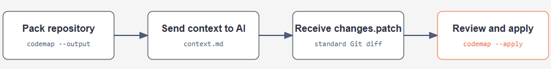

# codemap

> **codemap** packs your repository into clear, AI-ready context. Choose which files to include, add Git history or reusable Skills, control output size, and safely review or apply changes returned as standard Git diffs.

[](https://dotnet.microsoft.com/download/dotnet/10.0) [](LICENSE)

## Contents

- [Installation](#installation)
- [Features](#features)
- [How to Run](#how-to-run)
- [Command reference](#command-reference)
- [Configuration](#configuration)
- [Advanced capabilities](#advanced-capabilities)
- [Contribution](#contribution)

## Installation

Install codemap as a global command-line tool. This lets you run `codemap` from any terminal and any project folder:

```bash
dotnet tool install --global Codemap.Cli
```

Then run it from any directory with `codemap`.

Running `codemap` without options scans the current directory. Change into the repository directory before running it.

> [!TIP]
> **Quick Start**
>
> - **Save a snapshot:** `codemap --format markdown --output repository.md`
> - **Print without a file:** `codemap --stdout --format markdown`
> - **Copy to clipboard:** `codemap --clipboard --format markdown`
> - **Generate patch context:** `codemap --stdout --patch` or `codemap -p`
> - **Preview and apply a patch:** `codemap --apply changes.patch` or `codemap -a changes.patch`

The usual AI-assisted workflow is:



Codemap produces context. It does not execute AI output, run Skill instructions, or silently modify repository files.

## Features

| | Capability | What it does |
| --- | --- | --- |
| 📦 | Repository packing | Combines selected text files into one AI-ready artifact. |
| 🎯 | File selection | Includes and excludes paths with glob patterns. |
| 🚫 | Ignore rules | Respects `.gitignore`, `.ignore`, and built-in generated-directory exclusions. |
| 📝 | Output formats | Renders Markdown, XML, JSON, or plain text. |
| 📤 | Output destinations | Writes to a file, stdout, or the system clipboard. |
| 🌳 | Repository context | Adds file summaries and directory structure to supported formats. |
| 🧹 | Content transformations | Removes comments or empty lines and adds line numbers. |
| 🩹 | Patch workflow | Generates patch instructions and safely previews, validates, and applies Git diffs. |
| 🧠 | Skill loading | Adds named or explicit project and user Skills as read-only context. |
| 🌿 | Git context | Includes working-tree diffs and recent commit logs. |
| 🛡️ | Security scanning | Optionally uses DevSkim to exclude files with actionable findings. |
| 🔢 | Token accounting | Reports per-file and total `cl100k_base` token counts. |
| 📏 | Output limits | Enforces file-size and token budgets and can split large output. |
| 🌐 | Remote repositories | Clones and packs a Git repository or selected branch. |
| ⚙️ | Configuration | Loads `codemap.json`, with CLI overrides. |
| 🧭 | Stable processing order | Processes files in path order for repeatable results. |
| 👀 | Watch mode | Reports local source changes so output can be refreshed. |

## How to Run

codemap's main workflow is simple: choose a source directory, select an output format, and write the generated repository context to a file. The examples below focus on core commands.

### ❔ Help

Use the built-in help whenever you need to check available commands and options:

```bash
codemap --help
```

### 🔀 Include and Exclude

Use `--include` to select files and `--exclude` to remove paths from that selection:

```bash
codemap \
	--include "src/**/*.cs,README.md" \
	--exclude "**/bin/**,**/obj/**" \
	--format markdown \
	--output source-context.md
```

Both options accept individual files, folders, comma-separated values, and glob patterns:

```bash
# One file and one folder, including all files below the folder
codemap --include "README.md,src"

# Every C# file, except generated files and build folders
codemap --include "**/*.cs" --exclude "**/*.generated.cs,**/bin/**,**/obj/**"

# Match a file name in any folder
codemap --include "*.cs" --exclude "test-*.cs"

# Match folders anywhere in the repository; spaces after commas are allowed
codemap --include "**/Api, **/tests" --exclude "/**/generated, **/bin"

# Match everything below folders anywhere in the repository
codemap --include "/**/Api/**" --exclude "/**/tests/**"
```

Pattern rules:

- `*` matches any characters except `/`.
- `**` matches across folders.
- `?` matches one character.
- A literal or wildcard folder such as `src` or `**/Api` includes or excludes everything below it.
- Leading and trailing `/` are optional for repository-relative patterns.
- Separate multiple files, folders, or patterns with commas.

codemap also reads `.gitignore` and `.ignore` automatically.

The same selection can use short aliases: `codemap -i "src/**/*.cs" -e "**/bin/**,**/obj/**" -f markdown -o source-context.md`.

### 🩹 Patch and Apply

Generate repository context with patch-generation instructions:

```bash
codemap stdout --patch
codemap stdout -p --format markdown
```

Send that context to an AI provider and ask it to return one standard unified Git diff. Save the response as `changes.patch`. Do not execute AI output as a shell script.

Review and apply the diff from the repository root:

```bash
codemap --apply changes.patch
```

The command:

1. Prints the complete diff preview.
2. Validates it with `git apply --check`.
3. Lists each changed repository-relative file.
4. Requests approval for every file.
5. Applies the diff with `git apply` only after all approvals.

Git is required for patch application. Rejecting any file cancels the operation without applying changes.

### 🧠 Skills

Load reusable AI instructions from a project or user Skill directory:

```bash
codemap stdout --skills review,architecture
```

Named Skills are searched in this order:

1. `.agents/skills/<name>/SKILL.md`
2. `.agent/skills/<name>/SKILL.md`
3. `.claude/skills/<name>/SKILL.md`
4. The same directories under the current user's home directory.

Load one exact Skill file when a deterministic path is preferred:

```bash
codemap stdout --skills .agents/skills/review/SKILL.md
```

Repeat `--skills` to load multiple names or explicit files. Use `-s` as its short alias. Skill files are read as text and never executed. Named Skills use project files before global files; explicit paths do not perform discovery.

### 📝 Format

The default format is Markdown. Use `--format` to choose another output format when needed:

```bash
# Human- and AI-friendly document
codemap --format markdown --output repository.md

# Structured data for another program
codemap --format json --output repository.json

# XML or simple text output
codemap --format xml --output repository.xml
codemap --format plain --output repository.txt
```

### 🛡️ Security Check

Use DevSkim to exclude files with actionable security findings before they enter the generated context:

```bash
codemap \
	--security-check \
	--format markdown \
	--output reviewed-context.md
```

codemap reports excluded files in the terminal. Node.js and npm are not required.

### 🌐 Remote

codemap can clone a repository and pack a selected branch:

```bash
codemap \
	--remote microsoft/generative-ai-for-beginners \
	--remote-branch main \
	--format markdown \
	--output remote-context.md
```

The same command accepts a complete Git URL. Git must be installed and available on `PATH` for remote repositories and Git metadata.

## 🔄 Workflows

### 🔍 Review a repository

Create a focused Markdown snapshot and send it to an AI tool with a specific request:

```bash
codemap \
	--include "src/**/*.cs,tests/**/*.cs,README.md" \
	--exclude "**/bin/**,**/obj/**" \
	--format markdown \
	--output review-context.md
```

Example request:

```text
Review this repository for correctness, security risks, and missing tests.
Do not propose changes outside the selected files. Reference files by path.
```

## Command Reference

General form:

```text
codemap [options]
codemap stdout [options]
codemap clipboard [options]
codemap --stdout [options]
codemap --clipboard [options]
```

Show the built-in command reference at any time:

```bash
codemap --help
```

| Command or option | Alias | Value | Description |
| --- | --- | --- | --- |
| `codemap [options]` | - | - | Pack the current directory into the configured output. |
| `codemap stdout [options]` | - | - | Write packed output to standard output. |
| `codemap clipboard [options]` | - | - | Copy packed output to the clipboard. |
| `codemap config save [options]` | - | - | Save only supplied options into a persistent configuration. |
| `--include` | `-i` | comma-separated globs | Include only matching paths. |
| `--exclude` | `-e` | comma-separated globs | Add exclusion patterns for this run. |
| `--format` | `-f` | `xml`, `markdown`, `md`, `json`, `plain`, `txt` | Output format. Defaults to Markdown. |
| `--output` | `-o` | path | Output file path. Defaults to `codemap-output.md`. |
| `--stdout` | - | flag | Write packed output to standard output. |
| `--clipboard` | - | flag | Copy packed output to the clipboard. |
| `--output-mode` | - | `file`, `stdout`, `clipboard` | Default output destination. Defaults to `file`. |
| `--copy-to-clipboard` | - | flag | Also copy normal file or stdout output to the clipboard. |
| `--no-copy-to-clipboard` | - | flag | Disable configured automatic clipboard copying for this run. |
| `--max-file-size` | `-m` | bytes | Skip files larger than this size before reading them. |
| `--token-budget` | `-t` | count | Fail if the final rendered output exceeds this token count. |
| `--apply` | `-a` | patch file | Preview, validate, request approval for, and apply a unified Git diff. |
| `--patch` | `-p` | flag | Add Git patch-generation instructions to the output. |
| `--skills` | `-s` | comma-separated names or paths | Load named or explicit Skills. Repeat to load multiple values. |
| `--watch` | `-w` | flag | Watch a directory and report changes. |
| `--version` | `-v` | flag | Show the tool version. |
| `--config` | `-c` | path | Configuration JSON file. Without this option, codemap searches for `codemap.json`. |
| `--config-template` | - | path | Create a ready-to-edit configuration JSON file. |
| `--path` | - | path | Configuration output path for `codemap config save`. |
| `--global` | - | flag | Save or use the user-level default configuration. |
| `--help` | `-h` | flag | Show command usage, options, and examples. |
| `--remote` | `-r` | URL or `owner/repository` | Clone a remote Git repository into a temporary directory before packing. |
| `--remote-branch` | `-b` | branch | Branch to clone when using `--remote`. |
| `--no-summary` | - | flag | Remove file count and token summary from structured output. |
| `--summary` | - | flag | Include file count and token summary. |
| `--no-tree` | - | flag | Remove the directory/file listing from structured output. |
| `--tree` | - | flag | Include the directory/file listing. |
| `--line-numbers` | - | flag | Prefix each output line with its line number. |
| `--no-line-numbers` | - | flag | Disable line numbers. |
| `--remove-comments` | - | flag | Remove common comments before rendering. |
| `--no-remove-comments` | - | flag | Preserve source comments. |
| `--remove-empty-lines` | - | flag | Remove blank lines after other transformations. |
| `--no-remove-empty-lines` | - | flag | Preserve blank lines. |
| `--security-check` | - | flag | Scan original files with DevSkim and exclude files with findings. |
| `--no-security-check` | - | flag | Disable security scanning. |
| `--include-diffs` | - | flag | Include `git diff` output. |
| `--no-include-diffs` | - | flag | Disable Git diff output. |
| `--include-logs` | - | flag | Include recent one-line Git commits. |
| `--no-include-logs` | - | flag | Disable Git commit output. |
| `--include-logs-count` | - | count | Number of commits to include. Defaults to 20. |
| `--split-output` | - | bytes | Split output into numbered files when the rendered content exceeds this size. |

Boolean options can be enabled or disabled explicitly. For example, `--security-check` enables scanning and `--no-security-check` disables it, overriding the configuration file for that run.

### Output formats

| Format | Best for | Option |
| --- | --- | --- |
| Markdown | Human review and most AI prompts | `--format markdown` |
| Plain text | Simple pipes and terminals | `--format plain` |
| JSON | Programmatic processing | `--format json` |
| XML | Consumers that prefer tagged structure | `--format xml` |

`--patch` preserves the selected output format while adding instructions for generating a standard unified Git diff. `stdout` and `clipboard` are output destinations; they are not formats.

## Configuration

Configuration uses JSON. codemap automatically loads `codemap.json` from the source root. If no repository config exists, it checks the user-level config:

| Platform | Default user config |
| --- | --- |
| Windows | `%APPDATA%/codemap/codemap.json` |
| Linux | `~/.config/codemap/codemap.json` |
| macOS | `~/Library/Application Support/codemap/codemap.json` |

Use `--config` to select another file. User-level config is independent of the global tool installation directory, so tool upgrades do not remove it.

Generate a starter configuration without writing JSON by hand:

```bash
codemap --config-template codemap.json
```

Save CLI overrides into the current configuration. Only options supplied to this command change; existing settings are preserved:

```bash
codemap config save \
	--removeComments true \
	--removeEmptyLines true \
	--enableSecurityCheck true \
	--copyToClipboard true
```

Boolean values use explicit `true` or `false` values when saving configuration. For example:

```bash
codemap config save \
	--max-file-size 500000 \
	--token-budget 12000 \
	--includeGitDiffs false
```

By default this updates `codemap.json`, which later commands load automatically. Use `--path` for another file and `--config` to choose the file being overridden:

```bash
codemap config save --config team.codemap.json --path team.codemap.json \
	--include "src, tests" --exclude "**/bin/**, **/obj/**"
codemap --config team.codemap.json
```

Save defaults for all repositories with:

```bash
codemap config save --global \
	--copyToClipboard true \
	--includeGitLogs true \
	--include-logs-count 10
```

The global file uses the platform path shown above.

Choose the default output destination with `outputMode`. The default is `file`:

```bash
codemap config save --global --output-mode stdout
```

Valid values are `file`, `stdout`, and `clipboard`. Explicit `--stdout`, `--clipboard`, or `stdout`/`clipboard` commands override the configured mode for one run.

```json
{
	"outputPath": "artifacts/repository.md",
	"format": "Markdown",
	"outputMode": "file",
	"copyToClipboard": true,
	"includeFileSummary": true,
	"includeDirectoryStructure": true,
	"showLineNumbers": false,
	"removeComments": true,
	"removeEmptyLines": true,
	"enableSecurityCheck": true,
	"maxFileSizeBytes": 500000,
	"tokenBudget": 12000,
	"includeGitDiffs": false,
	"includeGitLogs": true,
	"gitLogCount": 10,
	"splitOutputBytes": 200000
}
```

When `copyToClipboard` is `true`, codemap writes its normal file output or stdout output and also copies the same final content to the clipboard. Use `--copy-to-clipboard` for a one-time override or `--no-copy-to-clipboard` to disable a configured setting for one run. `--clipboard` remains clipboard-only output.

Command-line values override configuration values. For list options such as `--include` and `--exclude`, the command-line value replaces the configured list.

## Advanced Capabilities

### 🚫 Ignore

Use `.ignore` to keep repository-specific files out of generated context, such as local notes, logs, fixtures, or generated output. Place it in the source root and add one glob per line; codemap also reads `.gitignore`, supports comments and ordered rules, and uses `!` to re-include a matching path. Common generated directories are excluded automatically.

### 🔢 Token Counts

Token counts help estimate how much context an AI tool will receive. codemap reports per-file and final-output counts using the GPT-4-compatible `cl100k_base` encoding; use `--token-budget` to reject oversized output, `--max-file-size` to skip large files, or `--split-output` to create smaller parts.

### 🔄 Workflow

Use `--remote` when the repository is not available locally; codemap clones it into a temporary directory and packs the selected branch. For repository history, `--include-diffs` adds current changes and `--include-logs` adds recent commits. `--watch` monitors a local source tree and reports changes so you can run codemap again.

## 🤝 Contribution

Thanks to all [contributors](https://github.com/meysamhadeli/codemap/graphs/contributors), you're awesome and this wouldn't be possible without you! The goal is to build a categorized, community-driven collection of very well-known resources.

Please follow this [contribution guideline](./CONTRIBUTION.md) to submit a pull request or create the issue.
