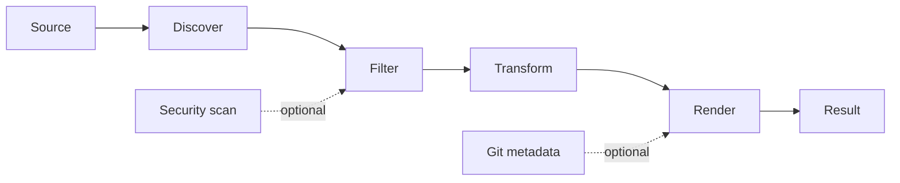

# Codemap

## Repository Summary
- Files: 40
- Characters: 119606
- Tokens: 25434

## Files
- `.env.test` (32 tokens)
- `.github/copilot-instructions.md` (521 tokens)
- `.github/dependabot.yml` (55 tokens)
- `.github/ISSUE_TEMPLATE/bug_report.yml` (178 tokens)
- `.github/ISSUE_TEMPLATE/feature_request.yml` (134 tokens)
- `.github/PULL_REQUEST_TEMPLATE.md` (99 tokens)
- `.github/workflows/ci.yml` (192 tokens)
- `.github/workflows/copilot-setup-steps.yml` (130 tokens)
- `.github/workflows/publish.yml` (448 tokens)
- `.gitignore` (2303 tokens)
- `AGENTS.md` (652 tokens)
- `CHANGELOG.md` (279 tokens)
- `Codemap.slnx` (86 tokens)
- `CONTRIBUTION.md` (447 tokens)
- `Directory.Build.props` (58 tokens)
- `Directory.Packages.props` (228 tokens)
- `docs/how-it-works.md` (661 tokens)
- `global.json` (55 tokens)
- `LICENSE` (222 tokens)
- `README.md` (2536 tokens)
- `src/Codemap.Cli/Codemap.Cli.csproj` (337 tokens)
- `src/Codemap.Cli/PatchApplier.cs` (822 tokens)
- `src/Codemap.Cli/Program.cs` (2435 tokens)
- `src/Codemap.Cli/RepositorySource.cs` (298 tokens)
- `src/Codemap.Core/Codemap.Core.csproj` (116 tokens)
- `src/Codemap.Core/CodePacker.cs` (2002 tokens)
- `src/Codemap.Core/GitMetadata.cs` (158 tokens)
- `src/Codemap.Core/PackConfiguration.cs` (651 tokens)
- `src/Codemap.Core/PackOptions.cs` (368 tokens)
- `src/Codemap.Core/PatchContext.cs` (293 tokens)
- `src/Codemap.Core/SecurityScanner.cs` (258 tokens)
- `src/Codemap.Core/Skills/Patch/SKILL.md` (689 tokens)
- `src/Codemap.Core/TokenCounter.cs` (56 tokens)
- `tests/Codemap.Tests/Codemap.Tests.csproj` (174 tokens)
- `tests/Codemap.Tests/Eval/PatchSkillEvaluationTests.cs` (1662 tokens)
- `tests/Codemap.Tests/Integration/CliIntegrationTests.cs` (2895 tokens)
- `tests/Codemap.Tests/Unit/AdvancedFeatureTests.cs` (335 tokens)
- `tests/Codemap.Tests/Unit/CodePackerTests.cs` (703 tokens)
- `tests/Codemap.Tests/Unit/ExtendedFeatureTests.cs` (1250 tokens)
- `tests/Codemap.Tests/Unit/PackConfigurationTests.cs` (616 tokens)

## .env.test

```
CODEMAP_RUN_LIVE_EVAL=true
CODEMAP_OPENAI_BASE_URL=https://api.deepseek.com/v1
CODEMAP_OPENAI_MODEL=deepseek-flash
```

## .github/copilot-instructions.md

```markdown
# Codemap AI Contribution Instructions

## Repository State

Codemap is a pre-scaffold C# tool repository. Do not invent existing projects, commands, namespaces, or dependencies. Before changing implementation, inspect the current solution and project files.

## C# Conventions

- Prefer clear, feature-oriented namespaces and small classes with one responsibility.
- Enable nullable reference types and analyzers in project configuration.
- Use async APIs and `CancellationToken` for file and process work that can be long-running.
- Treat paths as cross-platform values; avoid platform-specific separators and shell assumptions.
- Keep core processing independent from CLI presentation and file-system side effects where practical.
- Use explicit options/configuration objects and validate them at boundaries.
- Avoid global mutable state, service locators, speculative abstractions, and unnecessary dependencies.

## Feature Design

A typical capability should separate source discovery, filtering, processing, formatting, and output. Add extension points only where callers need customization. Prefer composition through a clear host/composition root.

## Testing

Add focused tests for each new behavior. Cover empty input, ignored paths, invalid configuration, cancellation, deterministic ordering, and platform-sensitive paths where relevant. Keep tests independent of the developer machine and network.

## Documentation and Change Tracking

User-visible behavior belongs in `README.md` or `docs/`. Record notable changes in `CHANGELOG.md`. Keep `AGENTS.md` aligned with actual commands and structure.

## Maintenance Matrix

| Change | Update or verify |
| --- | --- |
| Add or move a production feature | Matching `src/` area, composition root, focused `tests/`, and `AGENTS.md` if structure changes |
| Add a CLI option or configuration field | Option model, validation, CLI help, tests, `README.md`, and `CHANGELOG.md` |
| Change source discovery/filtering | Discovery and filter implementations, path-focused tests, docs describing inclusion/exclusion behavior |
| Change output format | Formatter, snapshot/golden tests if used, output docs, compatibility notes in `CHANGELOG.md` |
| Add a package or external service | Project file, lock/restore behavior, CI, security review, and contributor instructions |
| Change build/test commands | Project files, `AGENTS.md`, README setup instructions, and both GitHub workflows |
| Change repository automation | Relevant workflow/template plus `AGENTS.md` and `CHANGELOG.md` when contributor behavior changes |

## Review Expectations

Keep pull requests narrowly scoped. Explain behavior changes and how they were tested. Do not modify existing user changes or commit generated output.

```

## .github/dependabot.yml

```
version: 2
updates:
  - package-ecosystem: nuget
    directory: "/"
    schedule:
      interval: monthly
  - package-ecosystem: github-actions
    directory: "/"
    schedule:
      interval: monthly

```

## .github/ISSUE_TEMPLATE/bug_report.yml

```
name: Bug report
description: Report a reproducible problem in Codemap.
title: "[Bug]: "
labels:
  - bug
body:
  - type: textarea
    id: problem
    attributes:
      label: Problem
      description: What happened, and what did you expect?
    validations:
      required: true
  - type: textarea
    id: reproduce
    attributes:
      label: Reproduction
      description: Provide the smallest command, input, or repository that reproduces the problem.
    validations:
      required: true
  - type: input
    id: version
    attributes:
      label: Version or commit
  - type: textarea
    id: environment
    attributes:
      label: Environment
      description: Include OS, .NET SDK version, and relevant configuration.
    validations:
      required: true

```

## .github/ISSUE_TEMPLATE/feature_request.yml

```
name: Feature request
description: Propose a focused improvement to Codemap.
title: "[Feature]: "
labels:
  - enhancement
body:
  - type: textarea
    id: problem
    attributes:
      label: Problem to solve
      description: What workflow or limitation should this address?
    validations:
      required: true
  - type: textarea
    id: proposal
    attributes:
      label: Proposed behavior
      description: Describe the smallest useful behavior and its expected inputs and outputs.
    validations:
      required: true
  - type: textarea
    id: alternatives
    attributes:
      label: Alternatives considered

```

## .github/PULL_REQUEST_TEMPLATE.md

```markdown
## Summary

Describe user-visible behavior and motivation.

## Changes

- 

## How to test

- [ ] `dotnet build` or the repository's documented build command
- [ ] Focused tests for changed behavior

## Checklist

- [ ] Scope is focused and public behavior is documented.
- [ ] Tests cover new or changed behavior.
- [ ] `AGENTS.md`, README, or docs were updated when needed.
- [ ] No generated output or secrets are included.

```

## .github/workflows/ci.yml

```
name: CI

on:
  push:
  pull_request:
    paths-ignore:
      - '**/*.md'
      - 'docs/**'
      - '.github/ISSUE_TEMPLATE/**'
      - '.github/PULL_REQUEST_TEMPLATE.md'

permissions:
  contents: read

jobs:
  dotnet:
    runs-on: ubuntu-latest
    steps:
      - name: Check out repository
        uses: actions/checkout@v4
      - name: Set up .NET
        uses: actions/setup-dotnet@v4
        with:
          dotnet-version: 10.x
      - name: Restore
        run: dotnet restore Codemap.slnx
      - name: Build
        run: dotnet build Codemap.slnx --no-restore --configuration Release
      - name: Test
        run: dotnet test --solution Codemap.slnx --no-build --configuration Release

```

## .github/workflows/copilot-setup-steps.yml

```
name: Copilot setup

on:
  workflow_dispatch:

permissions:
  contents: read

jobs:
  setup:
    runs-on: ubuntu-latest
    steps:
      - name: Check out repository
        uses: actions/checkout@v4
      - name: Set up .NET
        uses: actions/setup-dotnet@v4
        with:
          dotnet-version: 10.x
      - name: Restore solution
        run: dotnet restore Codemap.slnx
      - name: Build solution
        run: dotnet build Codemap.slnx --no-restore --configuration Release

```

## .github/workflows/publish.yml

```
name: Publish NuGet package

on:
  push:
    tags:
      - 'v*.*.*'
  workflow_dispatch:
    inputs:
      version:
        description: Package version to publish, for example 1.0.1
        required: true
        type: string

permissions:
  contents: read

jobs:
  publish:
    runs-on: ubuntu-latest
    steps:
      - name: Check out repository
        uses: actions/checkout@v4

      - name: Set up .NET
        uses: actions/setup-dotnet@v4
        with:
          dotnet-version: 10.x

      - name: Restore
        run: dotnet restore Codemap.slnx

      - name: Determine package version
        shell: bash
        run: |
          version="${GITHUB_REF_NAME#v}"
          if [[ "$GITHUB_EVENT_NAME" == "workflow_dispatch" ]]; then
            version="${{ inputs.version }}"
          fi
          echo "PACKAGE_VERSION=$version" >> "$GITHUB_ENV"

      - name: Build
        run: dotnet build Codemap.slnx --no-restore --configuration Release -p:Version="$PACKAGE_VERSION"

      - name: Test
        run: dotnet test --solution Codemap.slnx --no-build --configuration Release

      - name: Pack CLI tool
        shell: bash
        run: |
          rm -rf ./artifacts/packages
          mkdir -p ./artifacts/packages
          dotnet pack src/Codemap.Cli/Codemap.Cli.csproj \
            --no-build \
            --configuration Release \
            --output ./artifacts/packages \
            -p:PackageVersion="$PACKAGE_VERSION"

          package="./artifacts/packages/Codemap.Cli.${PACKAGE_VERSION}.nupkg"
          test -f "$package"
          echo "PACKAGE_PATH=$package" >> "$GITHUB_ENV"

      - name: Publish package
        run: dotnet nuget push "$PACKAGE_PATH" --api-key "${{ secrets.NUGET_API_KEY }}" --source https://api.nuget.org/v3/index.json --skip-duplicate
```

## .gitignore

```
## Ignore Visual Studio temporary files, build results, and
## files generated by popular Visual Studio add-ons.
##
## Get latest from https://github.com/github/gitignore/blob/main/VisualStudio.gitignore

# User-specific files
*.rsuser
*.suo
*.user
*.userosscache
*.sln.docstates
*.env
!.env.test
!.env.test
# User-specific files (MonoDevelop/Xamarin Studio)
*.userprefs

# Mono auto generated files
mono_crash.*

# Build results
[Dd]ebug/
[Dd]ebugPublic/
[Rr]elease/
[Rr]eleases/

[Dd]ebug/x64/
[Dd]ebugPublic/x64/
[Rr]elease/x64/
[Rr]eleases/x64/
bin/x64/
obj/x64/

[Dd]ebug/x86/
[Dd]ebugPublic/x86/
[Rr]elease/x86/
[Rr]eleases/x86/
bin/x86/
obj/x86/

[Ww][Ii][Nn]32/
[Aa][Rr][Mm]/
[Aa][Rr][Mm]64/
[Aa][Rr][Mm]64[Ee][Cc]/
bld/
[Oo]bj/
[Oo]ut/
[Ll]og/
[Ll]ogs/

# Build results on 'Bin' directories
**/[Bb]in/*
# Uncomment if you have tasks that rely on *.refresh files to move binaries
# (https://github.com/github/gitignore/pull/3736)
#!**/[Bb]in/*.refresh

# Visual Studio 2015/2017 cache/options directory
.vs/
# Uncomment if you have tasks that create the project's static files in wwwroot
#wwwroot/

# Visual Studio 2017 auto generated files
Generated\ Files/

# MSTest test Results
[Tt]est[Rr]esult*/
[Bb]uild[Ll]og.*
*.trx

# NUnit
*.VisualState.xml
TestResult.xml
nunit-*.xml

# Approval Tests result files
*.received.*

# Build Results of an ATL Project
[Dd]ebugPS/
[Rr]eleasePS/
dlldata.c

# Benchmark Results
BenchmarkDotNet.Artifacts/

# .NET Core
project.lock.json
project.fragment.lock.json
artifacts/
.artifacts/

# ASP.NET Scaffolding
ScaffoldingReadMe.txt

# StyleCop
StyleCopReport.xml

# Files built by Visual Studio
*_i.c
*_p.c
*_h.h
*.ilk
*.meta
*.obj
*.idb
*.iobj
*.pch
*.pdb
*.ipdb
*.pgc
*.pgd
*.rsp
# but not Directory.Build.rsp, as it configures directory-level build defaults
!Directory.Build.rsp
*.sbr
*.tlb
*.tli
*.tlh
*.tmp
*.tmp_proj
*_wpftmp.csproj
*.log
*.tlog
*.vspscc
*.vssscc
.builds
*.pidb
*.svclog
*.scc

# Chutzpah Test files
_Chutzpah*

# Visual C++ cache files
ipch/
*.aps
*.ncb
*.opendb
*.opensdf
*.sdf
*.cachefile
*.VC.db
*.VC.VC.opendb

# Visual Studio profiler
*.psess
*.vsp
*.vspx
*.sap

# Visual Studio Trace Files
*.e2e

# TFS 2012 Local Workspace
$tf/

# Guidance Automation Toolkit
*.gpState

# ReSharper is a .NET coding add-in
_ReSharper*/
*.[Rr]e[Ss]harper
*.DotSettings.user

# TeamCity is a build add-in
_TeamCity*

# DotCover is a Code Coverage Tool
*.dotCover

# AxoCover is a Code Coverage Tool
.axoCover/*
!.axoCover/settings.json

# Coverlet is a free, cross platform Code Coverage Tool
coverage*.json
coverage*.xml
coverage*.info

# Visual Studio code coverage results
*.coverage
*.coveragexml

# NCrunch
_NCrunch_*
.NCrunch_*
.*crunch*.local.xml
nCrunchTemp_*

# MightyMoose
*.mm.*
AutoTest.Net/

# Web workbench (sass)
.sass-cache/

# Installshield output folder
[Ee]xpress/

# DocProject is a documentation generator add-in
DocProject/buildhelp/

# Local tool and editor configuration
.mcp.json
.idea/
*.sln.iml
.vscode/*.code-workspace

# Local dependencies and coverage output
node_modules/
.npm/
coverage/

# Environment and operating-system files
.env
.env.*
!.env.test
.DS_Store
Thumbs.db
DocProject/Help/*.HxT
DocProject/Help/*.HxC
DocProject/Help/*.hhc
DocProject/Help/*.hhk
DocProject/Help/*.hhp
DocProject/Help/Html2
DocProject/Help/html

# Click-Once directory
publish/

# Publish Web Output
*.[Pp]ublish.xml
*.azurePubxml
# Note: Comment the next line if you want to checkin your web deploy settings,
# but database connection strings (with potential passwords) will be unencrypted
*.pubxml
*.publishproj

# Microsoft Azure Web App publish settings. Comment the next line if you want to
# checkin your Azure Web App publish settings, but sensitive information contained
# in these scripts will be unencrypted
PublishScripts/

# NuGet Packages
*.nupkg
# NuGet Symbol Packages
*.snupkg
# The packages folder can be ignored because of Package Restore
**/[Pp]ackages/*
# except build/, which is used as an MSBuild target.
!**/[Pp]ackages/build/
# Uncomment if necessary however generally it will be regenerated when needed
#!**/[Pp]ackages/repositories.config
# NuGet v3's project.json files produces more ignorable files
*.nuget.props
*.nuget.targets

# Microsoft Azure Build Output
csx/
*.build.csdef

# Microsoft Azure Emulator
ecf/
rcf/

# Windows Store app package directories and files
AppPackages/
BundleArtifacts/
Package.StoreAssociation.xml
_pkginfo.txt
*.appx
*.appxbundle
*.appxupload

# Visual Studio cache files
# files ending in .cache can be ignored
*.[Cc]ache
# but keep track of directories ending in .cache
!?*.[Cc]ache/

# Others
ClientBin/
~$*
*~
*.dbmdl
*.dbproj.schemaview
*.jfm
*.pfx
*.publishsettings
orleans.codegen.cs

# Including strong name files can present a security risk
# (https://github.com/github/gitignore/pull/2483#issue-259490424)
#*.snk

# Since there are multiple workflows, uncomment next line to ignore bower_components
# (https://github.com/github/gitignore/pull/1529#issuecomment-104372622)
#bower_components/

# RIA/Silverlight projects
Generated_Code/

# Backup & report files from converting an old project file
# to a newer Visual Studio version. Backup files are not needed,
# because we have git ;-)
_UpgradeReport_Files/
Backup*/
UpgradeLog*.XML
UpgradeLog*.htm
ServiceFabricBackup/
*.rptproj.bak

# SQL Server files
*.mdf
*.ldf
*.ndf

# Business Intelligence projects
*.rdl.data
*.bim.layout
*.bim_*.settings
*.rptproj.rsuser
*- [Bb]ackup.rdl
*- [Bb]ackup ([0-9]).rdl
*- [Bb]ackup ([0-9][0-9]).rdl

# Microsoft Fakes
FakesAssemblies/

# GhostDoc plugin setting file
*.GhostDoc.xml

# Node.js Tools for Visual Studio
.ntvs_analysis.dat
node_modules/

# Visual Studio 6 build log
*.plg

# Visual Studio 6 workspace options file
*.opt

# Visual Studio 6 auto-generated workspace file (contains which files were open etc.)
*.vbw

# Visual Studio 6 workspace and project file (working project files containing files to include in project)
*.dsw
*.dsp

# Visual Studio 6 technical files
*.ncb
*.aps

# Visual Studio LightSwitch build output
**/*.HTMLClient/GeneratedArtifacts
**/*.DesktopClient/GeneratedArtifacts
**/*.DesktopClient/ModelManifest.xml
**/*.Server/GeneratedArtifacts
**/*.Server/ModelManifest.xml
_Pvt_Extensions

# Paket dependency manager
**/.paket/paket.exe
paket-files/

# FAKE - F# Make
**/.fake/

# CodeRush personal settings
**/.cr/personal

# Python Tools for Visual Studio (PTVS)
**/__pycache__/
*.pyc

# Cake - Uncomment if you are using it
#tools/**
#!tools/packages.config

# Tabs Studio
*.tss

# Telerik's JustMock configuration file
*.jmconfig

# BizTalk build output
*.btp.cs
*.btm.cs
*.odx.cs
*.xsd.cs

# OpenCover UI analysis results
OpenCover/

# Azure Stream Analytics local run output
ASALocalRun/

# MSBuild Binary and Structured Log
*.binlog
MSBuild_Logs/

# AWS SAM Build and Temporary Artifacts folder
.aws-sam

# NVidia Nsight GPU debugger configuration file
*.nvuser

# MFractors (Xamarin productivity tool) working folder
**/.mfractor/

# Local History for Visual Studio
**/.localhistory/

# Visual Studio History (VSHistory) files
.vshistory/

# BeatPulse healthcheck temp database
healthchecksdb

# Backup folder for Package Reference Convert tool in Visual Studio 2017
MigrationBackup/

# Ionide (cross platform F# VS Code tools) working folder
**/.ionide/

# Fody - auto-generated XML schema
FodyWeavers.xsd

# VS Code files for those working on multiple tools
.vscode/*
!.vscode/settings.json
!.vscode/tasks.json
!.vscode/launch.json
!.vscode/extensions.json
!.vscode/*.code-snippets

# Local History for Visual Studio Code
.history/

# Built Visual Studio Code Extensions
*.vsix

# Windows Installer files from build outputs
*.cab
*.msi
*.msix
*.msm
*.msp

```

## AGENTS.md

```markdown
# codemap Contributor Guide

## Project Overview

codemap is a C# developer tool for packaging source code into AI-friendly output. The current implementation is intentionally small and extensible.

## Repository Structure

The repository uses a solution with these boundaries:

- `src/Codemap.Core/`: reusable discovery, transformation, and rendering pipeline.
- `src/Codemap.Cli/`: command-line host and argument mapping.
- `tests/Codemap.Tests/Unit/`: focused core behavior tests.
- `tests/Codemap.Tests/Integration/`: process-level CLI tests.
- `docs/`: user and architecture documentation when behavior becomes stable.

Do not add generated build output to source control.

## Tech Stack

- C# and .NET 10, using the SDK version declared by `Directory.Build.props` or `global.json`.
- Prefer built-in .NET APIs and small focused abstractions before adding dependencies.
- Keep command-line concerns separate from core processing logic so the core can be reused by other hosts.

## Build and Run

Build with `dotnet build Codemap.slnx`. Test with `dotnet test --solution Codemap.slnx`. Run the installed CLI from the target repository directory with `codemap --format markdown --output codemap-output.md`.

## Testing

New behavior should include focused tests under `tests/Codemap.Tests/`. Prefer deterministic tests for file discovery, filtering, formatting, configuration, and error handling.

## Key Patterns and Conventions

- Use feature-oriented folders and explicit interfaces at extension points.
- Keep public APIs small and names descriptive.
- Separate input discovery, processing, formatting, and output writing.
- Make configuration explicit and composable; avoid hidden global state.
- Preserve cancellation, predictable error reporting, and cross-platform path behavior.
- Use nullable reference types and analyzers when the first project is created.
- Do not introduce abstractions without a current caller or clear extension point.

## Adding a New Feature

1. Identify the owning capability under `src/`.
2. Add or extend a small interface only when multiple implementations or user customization require it.
3. Register the implementation through the host's composition root; do not use scattered service-locator lookups.
4. Add focused tests under the matching `tests/` area.
5. Update `README.md`, `docs/`, and `CHANGELOG.md` when the feature changes user-visible behavior.
6. Update `.github/copilot-instructions.md` if the dependency or registration path changes.

## CI/CD

GitHub Actions workflows build and test `Codemap.slnx` on pull requests and pushes.

## Documentation Status

User-facing usage is documented in `README.md`; pipeline boundaries are documented in `docs/how-it-works.md`.

## Common Pitfalls

- Keep C# namespaces aligned with feature-oriented boundaries rather than external project layouts.
- Do not read every file into memory by default; support bounded, cancellable processing.
- Do not make output formatting inseparable from source discovery or configuration.
- Do not add a package before checking whether the .NET platform already provides the needed capability.
- Do not claim a feature is implemented until it has a test and documented behavior.

```

## CHANGELOG.md

```markdown
# Changelog

All notable changes to codemap will be documented here.

The format follows [Keep a Changelog](https://keepachangelog.com/en/1.1.0/). Versioning will be adopted when the first release process is defined.

## Unreleased

### Added

- Initial codemap core, CLI, output formats, filtering, transformations, and tests.
- Added short aliases for primary CLI options, including help, version, format, output, remote, config, include, exclude, and max file size.
- Added `-t` for `--token-budget` and `-w` for `--watch`.
- Added `stdout` and `clipboard` subcommands for file-free output.
- Added `-s` and `-c` aliases for `stdout` and `clipboard`, using TextCopy for cross-platform clipboard support; `--config` is now long-only.
- Added JSON configuration, ignore files, Git metadata, remote input, watch notifications, security scanning, size limits, and split output.
- Added `--patch` mode for producing Markdown context with Bash patch-script generation instructions.
- Added explicit `apply` workflow for previewing and approving generated patch scripts.
- Added GPT-4-compatible token counting, per-file token metadata, `.ignore` and negation support, binary-file skipping, security-based file exclusion, and richer output summaries.

```

## Codemap.slnx

```
<Solution>
  <Folder Name="/src/">
    <Project Path="src/Codemap.Cli/Codemap.Cli.csproj" />
    <Project Path="src/Codemap.Core/Codemap.Core.csproj" />
  </Folder>
  <Folder Name="/tests/">
    <Project Path="tests/Codemap.Tests/Codemap.Tests.csproj" />
  </Folder>
</Solution>

```

## CONTRIBUTION.md

```markdown
# Contributing to codemap

> [!TIP]
> Keep changes small, testable, and easy to review. Start with [AGENTS.md](AGENTS.md) for repository conventions.

Thanks for contributing to codemap.

## 🧭 Start Here

- Read [README.md](README.md) for installation, CLI usage, configuration, and feature behavior.
- Read [docs/how-it-works.md](docs/how-it-works.md) before changing the packing pipeline or adding an extension point.
- Read [AGENTS.md](AGENTS.md) for repository structure, conventions, and maintenance expectations.

## 🛠️ Development Setup

Requirements:

- .NET SDK 10 or newer.
- Git for Git-related tests and remote repository behavior.

Restore, build, and test with:

```bash
dotnet restore Codemap.slnx
dotnet build Codemap.slnx
dotnet test --solution Codemap.slnx
```

## 🗂️ Project Structure

- `src/Codemap.Core/`: reusable discovery, transformation, rendering, and metadata pipeline.
- `src/Codemap.Cli/`: command-line host and argument mapping.
- `tests/Codemap.Tests/Unit/`: focused core behavior tests.
- `tests/Codemap.Tests/Integration/`: process-level CLI tests.
- `docs/`: architecture and implementation guidance.

## ✍️ Making Changes

- Keep core processing independent from CLI presentation where practical.
- Preserve deterministic ordering, cancellation, cross-platform paths, and explicit configuration.
- Add focused tests for every new behavior.
- Update [README.md](README.md) for user-visible behavior.
- Update [docs/how-it-works.md](docs/how-it-works.md) when pipeline boundaries or extension guidance change.
- Update [CHANGELOG.md](CHANGELOG.md) for notable user-visible changes.
- Do not commit generated output from `bin/`, `obj/`, `artifacts/`, or test result directories.

## 🔎 Pull Requests

Keep changes focused. Explain what changed, why it changed, and how it was tested. Confirm that the solution builds, tests pass, and no unrelated files were modified.

```

## Directory.Build.props

```
<Project>
  <PropertyGroup>
    <TargetFramework>net10.0</TargetFramework>
    <LangVersion>latest</LangVersion>
    <ImplicitUsings>enable</ImplicitUsings>
    <Nullable>enable</Nullable>
  </PropertyGroup>
</Project>

```

## Directory.Packages.props

```
<Project>
  <PropertyGroup>
    <ManagePackageVersionsCentrally>true</ManagePackageVersionsCentrally>
    <CentralPackageTransitivePinningEnabled>true</CentralPackageTransitivePinningEnabled>
  </PropertyGroup>

  <ItemGroup>
    <PackageVersion Include="Microsoft.CST.DevSkim" Version="1.0.90" />
    <PackageVersion Include="Microsoft.Extensions.AI.Evaluation" Version="10.10.0" />
    <PackageVersion Include="Microsoft.Extensions.AI.OpenAI" Version="10.10.0" />
    <PackageVersion Include="Microsoft.ML.Tokenizers" Version="2.0.0" />
    <PackageVersion Include="Microsoft.ML.Tokenizers.Data.Cl100kBase" Version="2.0.0" />
    <PackageVersion Include="Shouldly" Version="4.3.0" />
    <PackageVersion Include="TextCopy" Version="6.2.1" />
    <PackageVersion Include="xunit.v3" Version="4.0.0" />
  </ItemGroup>
</Project>

```

## docs/how-it-works.md

```markdown
# How codemap Works

> [!NOTE]
> This page describes implementation boundaries. For installation and usage, see the [user guide](../README.md).

## Pipeline

codemap follows a small pipeline so each stage can evolve independently:

Users can run `codemap --help` or `codemap -h` at any time to display all commands and options directly in the terminal. `codemap stdout` or `codemap -s` prints packed content without creating a file, while `codemap clipboard` or `codemap -c` copies it through TextCopy. Primary source, selection, and output options also have short aliases documented in the [user guide](../README.md#command-reference).



1. **Discover**: `CodePacker` finds files beneath the configured root in deterministic path order.
2. **Filter**: include patterns, default exclusions, custom exclude patterns, `.gitignore`, and `.ignore` determine which paths remain.
3. **Transform**: optional line numbers, comment removal, and empty-line removal modify content.
4. **Render**: renderers produce XML, Markdown, plain text, or JSON.
5. **Report**: the result includes file count, character count, token counts, Git metadata, and security exclusions.

## Configuration Precedence

```text
Built-in defaults < codemap.json < explicit CLI options
```

Command-line values override file configuration. Include and exclude lists supplied on the command line replace their configured lists.

Configuration is loaded from `codemap.json` when present. Explicit CLI options override file configuration. Exclude patterns are read from `.gitignore` and `.ignore`, in addition to options and built-in generated-directory exclusions. Each file uses one pattern per line; blank lines and `#` comments are skipped. Patterns are evaluated in order and support `!` negation. `.gitignore` is loaded first, `.ignore` second, and `--exclude` patterns after both files. Include patterns are applied last.

## Optional Stages

- Bounded file-size filtering, output splitting, and token budgets keep processing predictable.
- DevSkim scans original source content before transformations and excludes files with actionable findings.
- Git diff/log metadata can be added to local or remote repository context.
- Binary and invalid UTF-8 files are skipped.
- Remote input clones a repository into a temporary directory; watch mode reports changes so callers can rerun packing.

The CLI maps command-line arguments to `PackOptions`; it does not own discovery or rendering. Future capabilities should follow the same boundary. Remote repository acquisition, Git metadata, DevSkim security analysis, external processors, split output, and watch mode can be added as independent services or pipeline stages with focused tests.

Token counts use the `cl100k_base` encoding through `Microsoft.ML.Tokenizers`; counts are included per file and in output summaries.

```

## global.json

```json
{
  "sdk": {
    "version": "10.0.103",
    "rollForward": "latestFeature",
    "allowPrerelease": false
  },
  "test": {
    "runner": "Microsoft.Testing.Platform"
  }
}

```

## LICENSE

```
MIT License

Copyright (c) 2026 Meysam Hadeli

Permission is hereby granted, free of charge, to any person obtaining a copy
of this software and associated documentation files (the "Software"), to deal
in the Software without restriction, including without limitation the rights
to use, copy, modify, merge, publish, distribute, sublicense, and/or sell
copies of the Software, and to permit persons to whom the Software is
furnished to do so, subject to the following conditions:

The above copyright notice and this permission notice shall be included in all
copies or substantial portions of the Software.

THE SOFTWARE IS PROVIDED "AS IS", WITHOUT WARRANTY OF ANY KIND, EXPRESS OR
IMPLIED, INCLUDING BUT NOT LIMITED TO THE WARRANTIES OF MERCHANTABILITY,
FITNESS FOR A PARTICULAR PURPOSE AND NONINFRINGEMENT. IN NO EVENT SHALL THE
AUTHORS OR COPYRIGHT HOLDERS BE LIABLE FOR ANY CLAIM, DAMAGES OR OTHER
LIABILITY, WHETHER IN AN ACTION OF CONTRACT, TORT OR OTHERWISE, ARISING FROM,
OUT OF OR IN CONNECTION WITH THE SOFTWARE OR THE USE OR OTHER DEALINGS IN THE
SOFTWARE.

```

## README.md

```markdown
# codemap

> **codemap** scans codebases and turns selected files into focused, deterministic context for AI tools and developers. It filters files, can include Git history, enforces token and size limits, and excludes files with security findings before producing the output.

[](https://dotnet.microsoft.com/download/dotnet/10.0) [](LICENSE)

## Contents

- [Installation](#installation)
- [Features](#features-what-codemap-provides)
- [How to run](#how-to-run)
- [Requirements](#requirements)
- [Command reference](#command-reference)
- [Configuration](#configuration)
- [Advanced capabilities](#advanced-capabilities)
- [Support](#support)
- [Contribution](#contribution)

## Installation

codemap is distributed as a .NET tool. Install the published package globally with:

```bash
dotnet tool install --global Codemap.Cli
```

Then run it from any directory with `codemap`.

Running `codemap` without options scans the current directory. Change into the repository directory before running it.

> [!TIP]
> **Quick Start**
>
> - **Save a snapshot:** `codemap --format markdown --output repository.md`
> - **Print without a file:** `codemap stdout --format markdown` or `codemap -s`
> - **Copy to clipboard:** `codemap clipboard --format markdown` or `codemap -c`
> - **Prepare patch context:** `codemap stdout --patch` or `codemap -p`

## Features

| | Capability | What it does |
| --- | --- | --- |
| 📦 | AI-ready packaging | Combines selected source files into one readable artifact. |
| 📤 | Three output modes | Writes to a file, prints to stdout, or copies directly to the clipboard. |
| 🧭 | Deterministic discovery | Processes files in stable path order for repeatable output. |
| 🎯 | Include and exclude rules | Filters paths with globs, `.gitignore`, and `.ignore`. |
| 🌿 | Git awareness | Includes diffs and recent commits when requested. |
| 🩹 | Patch mode | Adds instructions for generating safe Bash patch scripts with `--patch` or `-p`. |
| 🔢 | Token counts | Reports GPT-4-compatible `cl100k_base` counts per file and overall. |
| 🛡️ | Security filtering | Uses DevSkim and excludes files with actionable findings. |
| 🧹 | Content cleanup | Removes comments or empty lines and can add line numbers. |
| 📝 | Multiple formats | Writes Markdown, XML, JSON, or plain text; patch mode preserves the selected format. |
| 📏 | Size controls | Supports file-size limits, token budgets, and split output. |
| 🌐 | Repository sources | Packs a local directory or clones a remote Git repository. |
| 👀 | Workflow support | Watches a directory for changes or exposes a reusable C# library. |

## How to Run

codemap's main workflow is simple: choose a source directory, select an output format, and write the generated repository context to a file. The examples below focus on core commands.

### ❔ Help

Use the built-in help whenever you need to check available commands and options:

```bash
codemap --help
```

### 🔀 Include and Exclude

Use `--include` to select files and `--exclude` to remove paths from that selection:

```bash
codemap \
	--include "src/**/*.cs,README.md" \
	--exclude "**/bin/**,**/obj/**" \
	--format markdown \
	--output source-context.md
```

codemap also reads `.gitignore` and `.ignore` automatically.

The same selection can use short aliases: `codemap -i "src/**/*.cs" -e "**/bin/**,**/obj/**" -f markdown -o source-context.md`.

### 🛡️ Security Check

Use DevSkim to exclude files with actionable security findings before they enter the generated context:

```bash
codemap \
	--security-check \
	--format markdown \
	--output reviewed-context.md
```

codemap reports excluded files in the terminal. Node.js and npm are not required.

### 📝 Format

The default format is Markdown. Use `--format` to choose another output format when needed:

```bash
# Human- and AI-friendly document
codemap --format markdown --output repository.md

# Structured data for another program
codemap --format json --output repository.json

# XML or simple text output
codemap --format xml --output repository.xml
codemap --format plain --output repository.txt
```

### 🌐 Remote

codemap can clone a repository and pack a selected branch:

```bash
codemap \
	--remote microsoft/generative-ai-for-beginners \
	--remote-branch main \
	--format markdown \
	--output remote-context.md
```

The same command accepts a complete Git URL. Git must be installed and available on `PATH` for remote repositories and Git metadata.

## Requirements

- .NET SDK 10 or newer.
- Git only when using `--remote`, `--include-diffs`, or `--include-logs`.
- Bash when applying a patch script with `codemap apply ...`.
- Node.js and npm are not required. Security scanning is implemented with DevSkim for .NET.

## Command Reference

General form:

```text
codemap [options]
codemap stdout [options]
codemap clipboard [options]
codemap -s [options]
codemap -c [options]
codemap apply <patch-script>
```

Show the built-in command reference at any time:

```bash
codemap --help
```

| Option | Alias | Value | Description |
| --- | --- | --- | --- |
| `--remote` | `-r` | URL or `owner/repository` | Clone a remote Git repository into a temporary directory before packing. |
| `--remote-branch` | `-b` | branch | Branch to clone when using `--remote`. |
| `--config` | - | path | Configuration JSON file. Without this option, codemap searches for `codemap.json`. |
| `--include` | `-i` | comma-separated globs | Include only matching paths, for example `**/*.cs,**/*.md`. |
| `--exclude` | `-e` | comma-separated globs | Add exclusion patterns for this run. |
| `--format` | `-f` | `xml`, `markdown`, `md`, `json`, `plain`, `txt` | Output format. Defaults to Markdown. |
| `--output` | `-o` | path | Output file path. Defaults to `codemap-output.md`. |
| `--patch` | `-p` | flag | Add patch-generation instructions using the selected output format. Defaults to Markdown. |
| `apply` | - | script path | Preview an AI-generated Bash patch script, approve each changed file, then apply it. |
| `--watch` | `-w` | flag | Watch the source tree and print a notification when files change. Run codemap again to regenerate output. |
| `--max-file-size` | `-m` | bytes | Skip files larger than this size before reading them. |
| `--token-budget` | `-t` | count | Fail if the final rendered output exceeds this token count. |
| `--no-summary` | - | flag | Remove file count and token summary from structured output. |
| `--no-tree` | - | flag | Remove the directory/file listing from structured output. |
| `--line-numbers` | - | flag | Prefix each output line with its line number. |
| `--remove-comments` | - | flag | Remove common `//` and `/* ... */` comments before rendering. |
| `--remove-empty-lines` | - | flag | Remove blank lines after other transformations. |
| `--security-check` | - | flag | Scan original files with DevSkim and exclude files with findings. |
| `--include-diffs` | - | flag | Include `git diff` output. |
| `--include-logs` | - | flag | Include recent one-line Git commits. |
| `--include-logs-count` | - | count | Number of commits to include. Defaults to 20. |
| `--split-output` | - | bytes | Split output into numbered files when the rendered content exceeds this size. |

Boolean options are enabled by writing the flag.

Review and apply a generated patch with `codemap apply patch.sh`. The command previews the script, then asks for approval for each detected changed file before execution.

## Configuration

Configuration uses JSON. codemap automatically loads `codemap.json` from the source root. Use `--config` to select another file.

```json
{
	"outputPath": "artifacts/repository.md",
	"format": "Markdown",
	"includeFileSummary": true,
	"includeDirectoryStructure": true,
	"showLineNumbers": false,
	"removeComments": true,
	"removeEmptyLines": true,
	"enableSecurityCheck": true,
	"maxFileSizeBytes": 500000,
	"tokenBudget": 12000,
	"includeGitDiffs": false,
	"includeGitLogs": true,
	"gitLogCount": 10,
	"splitOutputBytes": 200000
}
```

Command-line values override configuration values. For list options such as `--include` and `--exclude`, the command-line value replaces the configured list.

## Advanced Capabilities

### Exclude

Use `.ignore` to keep repository-specific files out of generated context, such as local notes, logs, fixtures, or generated output. Place it in the source root and add one glob per line; codemap also reads `.gitignore`, supports comments and ordered rules, and uses `!` to re-include a matching path. Common generated directories are excluded automatically.

### Security

Use `--security-check` when the source may contain credentials, unsafe cryptography, or other known security problems. codemap scans original UTF-8 files before cleanup, omits files with actionable DevSkim findings instead of stopping the entire pack, and reports excluded paths in the console and result model.

### Tokens

Token counts help estimate how much context an AI tool will receive. codemap reports per-file and final-output counts using the GPT-4-compatible `cl100k_base` encoding; use `--token-budget` to reject oversized output, `--max-file-size` to skip large files, or `--split-output` to create smaller parts.

### Workflow

Use `--remote` when the repository is not available locally; codemap clones it into a temporary directory and packs the selected branch. For repository history, `--include-diffs` adds current changes and `--include-logs` adds recent commits. `--watch` monitors a local source tree and reports changes so you can run codemap again.

# 🌟 Support

If you like my work, feel free to:

- ⭐ this repository. And we will be happy together :)

Thanks a bunch for supporting me!

## 🤝 Contribution

Thanks to all [contributors](https://github.com/meysamhadeli/codemap/graphs/contributors), you're awesome and this wouldn't be possible without you! The goal is to build a categorized, community-driven collection of very well-known resources.

Please follow this [contribution guideline](./CONTRIBUTION.md) to submit a pull request or create the issue.
```

## src/Codemap.Cli/Codemap.Cli.csproj

```
<Project Sdk="Microsoft.NET.Sdk">

  <ItemGroup>
    <ProjectReference Include="..\Codemap.Core\Codemap.Core.csproj" />
    <PackageReference Include="TextCopy" />
    <None Include="..\..\README.md" Pack="true" PackagePath="README.md" />
  </ItemGroup>

  <PropertyGroup>
    <OutputType>Exe</OutputType>
    <PackAsTool>true</PackAsTool>
    <ToolCommandName>codemap</ToolCommandName>
    <PackageId>Codemap.Cli</PackageId>
    <Version>1.0.4</Version>
    <Authors>Meysam Hadeli</Authors>
    <Description>A command-line tool that scans repositories and produces deterministic, AI-ready context in Markdown, JSON, XML, or plain text, with filtering, Git metadata, token budgets, and security scanning.</Description>
    <PackageTags>ai;repository;context;code;dotnet</PackageTags>
    <PackageProjectUrl>https://github.com/meysamhadeli/codemap</PackageProjectUrl>
    <RepositoryUrl>https://github.com/meysamhadeli/codemap.git</RepositoryUrl>
    <RepositoryType>git</RepositoryType>
    <PackageReleaseNotes>Initial release of the codemap command-line tool.</PackageReleaseNotes>
    <Copyright>Copyright (c) 2026 Meysam Hadeli</Copyright>
    <PackageLicenseExpression>MIT</PackageLicenseExpression>
    <PackageReadmeFile>README.md</PackageReadmeFile>
  </PropertyGroup>

</Project>

```

## src/Codemap.Cli/PatchApplier.cs

```csharp
using System.Diagnostics;

namespace Codemap.Cli;

internal static class PatchApplier
{
    public static async Task<int> ApplyAsync(
        string patchPath,
        string repositoryRoot,
        CancellationToken cancellationToken)
    {
        var fullPatchPath = Path.GetFullPath(patchPath, repositoryRoot);
        if (!File.Exists(fullPatchPath))
        {
            Console.Error.WriteLine($"codemap: patch file not found: {patchPath}");
            return 1;
        }

        var patch = await File.ReadAllTextAsync(fullPatchPath, cancellationToken);
        var changedFiles = ExtractChangedFiles(patch);
        if (changedFiles.Count == 0)
        {
            Console.Error.WriteLine("codemap: no file changes found in unified diff.");
            return 1;
        }

        Console.WriteLine("Git patch preview:");
        Console.WriteLine(patch);

        var check = await RunGitAsync(repositoryRoot, ["apply", "--check", "--whitespace=error-all", fullPatchPath], cancellationToken);
        if (check.ExitCode != 0)
        {
            Console.Error.WriteLine("codemap: git apply --check failed.");
            Console.Error.Write(check.Error);
            return check.ExitCode;
        }

        if (Console.IsInputRedirected)
        {
            Console.Error.WriteLine("codemap: approval required for each file; run patch from an interactive terminal.");
            return 1;
        }

        foreach (var changedFile in changedFiles)
        {
            Console.Write($"Apply changes to '{changedFile}'? [y/N] ");
            if (!string.Equals(Console.ReadLine()?.Trim(), "y", StringComparison.OrdinalIgnoreCase))
            {
                Console.WriteLine("Patch cancelled. No changes applied.");
                return 1;
            }
        }

        var apply = await RunGitAsync(repositoryRoot, ["apply", "--whitespace=error-all", fullPatchPath], cancellationToken);
        if (apply.ExitCode != 0)
        {
            Console.Error.WriteLine("codemap: git apply failed.");
            Console.Error.Write(apply.Error);
            return apply.ExitCode;
        }

        Console.WriteLine($"Applied changes to {changedFiles.Count} file(s).");
        return 0;
    }

    private static IReadOnlyList<string> ExtractChangedFiles(string patch)
    {
        var files = new HashSet<string>(StringComparer.Ordinal);
        foreach (var line in patch.Split('\n'))
        {
            if (!line.StartsWith("+++ b/", StringComparison.Ordinal))
            {
                continue;
            }

            var path = line[6..].TrimEnd('\r');
            if (!path.Equals("/dev/null", StringComparison.Ordinal))
            {
                files.Add(path);
            }
        }

        foreach (var line in patch.Split('\n'))
        {
            if (!line.StartsWith("--- a/", StringComparison.Ordinal))
            {
                continue;
            }

            var path = line[6..].TrimEnd('\r');
            if (!path.Equals("/dev/null", StringComparison.Ordinal))
            {
                files.Add(path);
            }
        }

        return files.OrderBy(path => path, StringComparer.Ordinal).ToArray();
    }

    private static async Task<GitResult> RunGitAsync(
        string repositoryRoot,
        IReadOnlyList<string> arguments,
        CancellationToken cancellationToken)
    {
        var startInfo = new ProcessStartInfo("git")
        {
            WorkingDirectory = repositoryRoot,
            RedirectStandardOutput = true,
            RedirectStandardError = true,
            UseShellExecute = false
        };
        foreach (var argument in arguments)
        {
            startInfo.ArgumentList.Add(argument);
        }

        using var process = Process.Start(startInfo);
        if (process is null)
        {
            return new GitResult(1, string.Empty, "codemap: unable to start git.\n");
        }

        var outputTask = process.StandardOutput.ReadToEndAsync(cancellationToken);
        var errorTask = process.StandardError.ReadToEndAsync(cancellationToken);
        await process.WaitForExitAsync(cancellationToken);
        return new GitResult(process.ExitCode, await outputTask, await errorTask);
    }

    private sealed record GitResult(int ExitCode, string Output, string Error);
}

```

## src/Codemap.Cli/Program.cs

```csharp
using Codemap.Core;
using Codemap.Cli;
using System.Text.Json;
using TextCopy;

var arguments = args.ToList();
if (arguments.FirstOrDefault()?.Equals("patch", StringComparison.OrdinalIgnoreCase) is true)
{
	var applyRoot = Directory.GetCurrentDirectory();
	var scriptPath = arguments.Skip(1).FirstOrDefault(argument => !argument.StartsWith("-", StringComparison.Ordinal));
	if (scriptPath is null)
	{
		Console.Error.WriteLine("Usage: codemap patch <patch-file>");
		return 1;
	}

	return await PatchApplier.ApplyAsync(
		scriptPath,
		applyRoot,
		CancellationToken.None);
}

var outputCommand = arguments.FirstOrDefault() switch
{
	"stdout" or "-s" => "stdout",
	"clipboard" or "-c" => "clipboard",
	_ => "file"
};
if (outputCommand is not "file")
{
	arguments.RemoveAt(0);
}

if (HasFlag(arguments, "--version", "-v"))
{
	var informationalVersion = typeof(Program).Assembly
		.GetCustomAttributes(typeof(System.Reflection.AssemblyInformationalVersionAttribute), inherit: false)
		.OfType<System.Reflection.AssemblyInformationalVersionAttribute>()
		.Select(attribute => attribute.InformationalVersion)
		.FirstOrDefault();
	Console.WriteLine((informationalVersion ?? typeof(Program).Assembly.GetName().Version?.ToString() ?? "unknown").Split('+')[0]);
	return 0;
}

if (HasFlag(arguments, "--help", "-h"))
{
	PrintHelp();
	return 0;
}

var root = Directory.GetCurrentDirectory();
var patchMode = HasFlag(arguments, "--patch", "-p");
var remote = GetOption(arguments, "--remote", "-r");
var configPath = GetOption(arguments, "--config") ?? FindDefaultConfig(root);
var include = GetOption(arguments, "--include", "-i");
var exclude = GetOption(arguments, "--exclude", "-e");

var options = new PackOptions
{
	RootDirectory = root,
	OutputPath = patchMode ? "codemap-patch-context.md" : "codemap-output.md",
	IncludePatterns = ["**/*"],
	IncludeFileSummary = true,
	IncludeDirectoryStructure = true,
	ShowLineNumbers = arguments.Contains("--line-numbers"),
	RemoveComments = arguments.Contains("--remove-comments"),
	RemoveEmptyLines = arguments.Contains("--remove-empty-lines"),
	TokenBudget = GetIntOption(arguments, "--token-budget", "-t"),
	MaxFileSizeBytes = GetLongOption(arguments, "--max-file-size", "-m"),
	EnableSecurityCheck = arguments.Contains("--security-check"),
	IncludeGitDiffs = arguments.Contains("--include-diffs"),
	IncludeGitLogs = arguments.Contains("--include-logs"),
	GitLogCount = GetIntOption(arguments, "--include-logs-count") ?? 20,
	SplitOutputBytes = GetIntOption(arguments, "--split-output"),
	Format = ParseFormat(GetOption(arguments, "--format", "-f"))
};

try
{
	var sourceRoot = remote is null
		? root
		: await RepositorySource.ResolveAsync(remote, GetOption(arguments, "--remote-branch", "-b"), CancellationToken.None);
	root = sourceRoot;
	options = options with { RootDirectory = sourceRoot };
	if (configPath is not null)
	{
		options = (await PackConfiguration.LoadAsync(configPath)).ApplyTo(options);
	}

	options = options with
	{
		OutputPath = GetOption(arguments, "--output", "-o") ?? options.OutputPath,
		Format = GetOption(arguments, "--format", "-f") is { } format ? ParseFormat(format) : options.Format,
		IncludePatterns = include is null ? options.IncludePatterns : SplitPatterns(include),
		ExcludePatterns = exclude is null ? options.ExcludePatterns : SplitPatterns(exclude),
		IncludeFileSummary = arguments.Contains("--no-summary") ? false : options.IncludeFileSummary,
		IncludeDirectoryStructure = arguments.Contains("--no-tree") ? false : options.IncludeDirectoryStructure,
		ShowLineNumbers = arguments.Contains("--line-numbers") || options.ShowLineNumbers,
		RemoveComments = arguments.Contains("--remove-comments") || options.RemoveComments,
		RemoveEmptyLines = arguments.Contains("--remove-empty-lines") || options.RemoveEmptyLines,
		TokenBudget = GetIntOption(arguments, "--token-budget", "-t") ?? options.TokenBudget
		,MaxFileSizeBytes = GetLongOption(arguments, "--max-file-size", "-m") ?? options.MaxFileSizeBytes
		,EnableSecurityCheck = arguments.Contains("--security-check") || options.EnableSecurityCheck
		,IncludeGitDiffs = arguments.Contains("--include-diffs") || options.IncludeGitDiffs
		,IncludeGitLogs = arguments.Contains("--include-logs") || options.IncludeGitLogs
		,SplitOutputBytes = GetIntOption(arguments, "--split-output") ?? options.SplitOutputBytes
	};

	var result = await new CodePacker().PackAsync(options);
	var content = patchMode ? PatchContext.Wrap(result.Content, options.Format) : result.Content;
	if (outputCommand is not "file" && options.SplitOutputBytes is > 0)
	{
		throw new InvalidOperationException("The stdout and clipboard commands cannot be combined with --split-output.");
	}

	if (outputCommand is "stdout")
	{
		Console.Write(content);
	}
	else if (outputCommand is "clipboard")
	{
		await CopyToClipboardAsync(content);
		Console.Error.WriteLine($"Copied {result.Files.Count} files to the clipboard ({result.TokenCount} tokens).");
	}
	else if (options.SplitOutputBytes is { } splitSize && splitSize > 0 && content.Length > splitSize)
	{
		var chunks = content.Chunk(splitSize).ToArray();
		for (var index = 0; index < chunks.Length; index++)
		{
			await File.WriteAllTextAsync($"{options.OutputPath}.{index + 1}", new string(chunks[index]));
		}
	}
	else
	{
		await File.WriteAllTextAsync(options.OutputPath, content);
	}
	if (outputCommand is "file")
	{
		Console.WriteLine($"Packed {result.Files.Count} files into {options.OutputPath} ({result.TokenCount} tokens).");
	}
	if (result.ExcludedFiles is { Count: > 0 })
	{
		Console.Error.WriteLine($"Excluded {result.ExcludedFiles.Count} files with security findings: {string.Join(", ", result.ExcludedFiles)}");
	}
	if (HasFlag(arguments, "--watch", "-w"))
	{
		using var watcher = new FileSystemWatcher(options.RootDirectory) { IncludeSubdirectories = true, EnableRaisingEvents = true };
		FileSystemEventHandler notify = (_, _) => Console.WriteLine("Source changed. Run codemap again to refresh output.");
		watcher.Changed += notify;
		watcher.Created += notify;
		watcher.Deleted += notify;
		Console.WriteLine("Watching for changes. Press Ctrl+C to stop.");
		await Task.Delay(Timeout.InfiniteTimeSpan);
	}
	return 0;
}
catch (Exception exception) when (exception is IOException or UnauthorizedAccessException or InvalidOperationException or DirectoryNotFoundException or JsonException or FormatException)
{
	Console.Error.WriteLine($"codemap: {exception.Message}");
	return 1;
}

static bool HasFlag(IReadOnlyList<string> arguments, params string[] names) =>
	names.Any(name => arguments.Contains(name, StringComparer.Ordinal));

static async Task CopyToClipboardAsync(string content)
{
	await ClipboardService.SetTextAsync(content);
}

static string? GetOption(IReadOnlyList<string> arguments, params string[] names)
{
	for (var index = 0; index + 1 < arguments.Count; index++)
	{
		if (names.Any(name => arguments[index].Equals(name, StringComparison.Ordinal)))
		{
			return arguments[index + 1];
		}
	}

	return null;
}

static IReadOnlyList<string> SplitPatterns(string value) => value.Split(',', StringSplitOptions.RemoveEmptyEntries | StringSplitOptions.TrimEntries);

static int? GetIntOption(IReadOnlyList<string> arguments, params string[] names)
{
	var value = GetOption(arguments, names);
	return value is null ? null : int.Parse(value, System.Globalization.CultureInfo.InvariantCulture);
}

static long? GetLongOption(IReadOnlyList<string> arguments, params string[] names)
{
	var value = GetOption(arguments, names);
	return value is null ? null : long.Parse(value, System.Globalization.CultureInfo.InvariantCulture);
}

static string? FindDefaultConfig(string root)
{
    var repositoryConfigPath = Path.Combine(root, "codemap.json");
    if (File.Exists(repositoryConfigPath)) return repositoryConfigPath;

    var userDirectory = Path.GetDirectoryName(GetUserConfigPath())!;
    var userConfigPath = Path.Combine(userDirectory, "codemap.json");
    if (File.Exists(userConfigPath)) return userConfigPath;

	return null;
}

static OutputFormat ParseFormat(string? value) => value?.ToLowerInvariant() switch
{
	"markdown" or "md" => OutputFormat.Markdown,
	"xml" => OutputFormat.Xml,
	"plain" or "txt" => OutputFormat.Plain,
	"json" => OutputFormat.Json,
	_ => OutputFormat.Markdown
};

static void PrintHelp()
{
	Console.WriteLine("codemap - package repositories into AI-friendly output");
	Console.WriteLine();
	Console.WriteLine("Usage:");
	Console.WriteLine("  codemap [options]");
	Console.WriteLine("  codemap stdout, -s [options]   Print packed content to stdout");
	Console.WriteLine("  codemap clipboard, -c [options] Copy packed content to clipboard");
	Console.WriteLine("  codemap patch <diff>         Preview and approve each Git diff file");
	Console.WriteLine();
	Console.WriteLine("Source:");
	Console.WriteLine("  -r, --remote <url|owner/repo> Clone a remote Git repository");
	Console.WriteLine("  -b, --remote-branch <branch>  Branch to clone");
	Console.WriteLine();
	Console.WriteLine("Selection:");
	Console.WriteLine("  -i, --include <patterns>      Comma-separated include globs");
	Console.WriteLine("  -e, --exclude <patterns>      Comma-separated exclusion globs");
	Console.WriteLine("  -m, --max-file-size <bytes>   Skip larger files");
	Console.WriteLine("  -c, --config <path>            Configuration JSON file");
	Console.WriteLine();
	Console.WriteLine("Output:");
	Console.WriteLine("  -f, --format <xml|markdown|json|plain>");
	Console.WriteLine("  -o, --output <path>           Output file (default: codemap-output.md)");
	Console.WriteLine("  --no-summary                  Omit summary metadata");
	Console.WriteLine("  --no-tree                     Omit directory structure");
	Console.WriteLine("  --split-output <bytes>        Split large output into numbered files");
	Console.WriteLine("  -p, --patch                   Add patch-generation instructions in selected format");
	Console.WriteLine();
	Console.WriteLine("Transformations and limits:");
	Console.WriteLine("  --security-check              Exclude files with DevSkim findings");
	Console.WriteLine("  --remove-comments             Remove common source comments");
	Console.WriteLine("  --remove-empty-lines          Remove blank lines");
	Console.WriteLine("  --line-numbers                Add line numbers");
	Console.WriteLine("  -t, --token-budget <count>    Fail when rendered output exceeds count");
	Console.WriteLine();
	Console.WriteLine("Git and workflow:");
	Console.WriteLine("  --include-diffs               Include git diff");
	Console.WriteLine("  --include-logs                Include recent git commits");
	Console.WriteLine("  --include-logs-count <count>  Number of commits (default: 20)");
	Console.WriteLine("  -w, --watch                   Report source changes");
	Console.WriteLine("  -v, --version                 Show the tool version");
	Console.WriteLine("  -h, --help                    Show this help");
	Console.WriteLine();
	Console.WriteLine("Examples:");
	Console.WriteLine("  codemap --format markdown --output repository.md");
	Console.WriteLine("  codemap --include \"**/*.cs\" --security-check");
	Console.WriteLine("  codemap --remote microsoft/generative-ai-for-beginners --remote-branch main");
	Console.WriteLine();
	Console.WriteLine("More documentation: README.md");
}

```

## src/Codemap.Cli/RepositorySource.cs

```csharp
using System.Diagnostics;

namespace Codemap.Cli;

internal static class RepositorySource
{
    public static async Task<string> ResolveAsync(string? remote, string? branch, CancellationToken cancellationToken)
    {
        if (string.IsNullOrWhiteSpace(remote))
        {
            return Directory.GetCurrentDirectory();
        }

        var destination = Path.Combine(Path.GetTempPath(), $"codemap-remote-{Guid.NewGuid():N}");
        var arguments = $"clone --depth 1{(string.IsNullOrWhiteSpace(branch) ? string.Empty : $" --branch {Quote(branch)}")} {Quote(NormalizeRemote(remote))} {Quote(destination)}";
        var startInfo = new ProcessStartInfo("git", arguments)
        {
            RedirectStandardError = true,
            RedirectStandardOutput = true,
            UseShellExecute = false,
            CreateNoWindow = true
        };
        using var process = Process.Start(startInfo) ?? throw new InvalidOperationException("Unable to start git.");
        var error = await process.StandardError.ReadToEndAsync(cancellationToken);
        await process.WaitForExitAsync(cancellationToken);
        if (process.ExitCode != 0)
        {
            throw new InvalidOperationException($"Unable to clone repository: {error.Trim()}");
        }

        return destination;
    }

    private static string NormalizeRemote(string remote) => remote.Contains('/') && !remote.Contains("://") ? $"https://github.com/{remote}.git" : remote;
    private static string Quote(string value) => $"\"{value.Replace("\"", "\\\"")}\"";
}

```

## src/Codemap.Core/Codemap.Core.csproj

```
<Project Sdk="Microsoft.NET.Sdk">

  <ItemGroup>
    <PackageReference Include="Microsoft.CST.DevSkim" />
    <PackageReference Include="Microsoft.ML.Tokenizers" />
    <PackageReference Include="Microsoft.ML.Tokenizers.Data.Cl100kBase" />
  </ItemGroup>

  <ItemGroup>
    <EmbeddedResource Include="Skills\Patch\SKILL.md">
      <LogicalName>Codemap.Core.Skills.Patch.SKILL.md</LogicalName>
    </EmbeddedResource>
  </ItemGroup>

</Project>

```

## src/Codemap.Core/CodePacker.cs

```csharp
using System.Text;
using System.Text.Json;
using System.Text.RegularExpressions;
using System.Xml.Linq;

namespace Codemap.Core;

public sealed class CodePacker
{
    private static readonly string[] DefaultExcludedDirectories = [".git", "bin", "obj", "node_modules", "dist", "coverage"];

    public async Task<PackResult> PackAsync(PackOptions options, CancellationToken cancellationToken = default)
    {
        var root = Path.GetFullPath(options.RootDirectory);
        if (!Directory.Exists(root))
        {
            throw new DirectoryNotFoundException($"Root directory does not exist: {root}");
        }

        var files = new List<PackedFile>();
        var sourcePaths = new List<string>();
        var enumerationOptions = new EnumerationOptions
        {
            RecurseSubdirectories = true,
            IgnoreInaccessible = true,
            AttributesToSkip = FileAttributes.System,
            ReturnSpecialDirectories = false
        };
        foreach (var path in Directory.EnumerateFiles(root, "*", enumerationOptions).OrderBy(path => path, StringComparer.OrdinalIgnoreCase))
        {
            cancellationToken.ThrowIfCancellationRequested();
            var relativePath = Normalize(Path.GetRelativePath(root, path));
            if (!IsIncluded(relativePath, options))
            {
                continue;
            }

            if (options.MaxFileSizeBytes is { } maxSize && new FileInfo(path).Length > maxSize)
            {
                continue;
            }

            if (!TryReadText(path, out var content))
            {
                continue;
            }

            sourcePaths.Add(relativePath);
            content = Transform(content, options);
            var lineCount = content.Length == 0 ? 0 : content.Split('\n').Length;
            files.Add(new PackedFile(relativePath, content, content.Length, lineCount, TokenCounter.Count(content)));
        }

        var git = new GitMetadata();
        var gitDiffs = options.IncludeGitDiffs ? await git.RunAsync(root, "diff", cancellationToken) : null;
        var gitLogs = options.IncludeGitLogs ? await git.RunAsync(root, $"log -n {options.GitLogCount} --oneline", cancellationToken) : null;
        var secrets = options.EnableSecurityCheck
            ? await new SecurityScanner().ScanAsync(root, sourcePaths, cancellationToken)
            : [];
        if (secrets.Count > 0) files = files.Where(file => !secrets.Contains(file.RelativePath, StringComparer.OrdinalIgnoreCase)).ToList();

        var contentOutput = Render(files, options, gitDiffs, gitLogs, secrets);
        var result = new PackResult(files, contentOutput, contentOutput.Length, TokenCounter.Count(contentOutput), gitDiffs, gitLogs, secrets);
        if (options.TokenBudget is { } budget && result.EstimatedTokenCount > budget)
        {
            throw new InvalidOperationException($"Packed output exceeds token budget of {budget}.");
        }

        return result;
    }

    private static bool IsIncluded(string relativePath, PackOptions options)
    {
        var segments = relativePath.Split('/');
        if (segments.Any(segment => DefaultExcludedDirectories.Contains(segment, StringComparer.OrdinalIgnoreCase)))
        {
            return false;
        }

        var excluded = false;
        foreach (var pattern in options.ExcludePatterns
            .Concat(ExcludeFileLoader.Load(options.RootDirectory, ".gitignore", ".ignore")))
        {
            var negated = pattern.StartsWith('!');
            var value = negated ? pattern[1..] : pattern;
            if (Matches(relativePath, value)) excluded = !negated;
        }
        if (excluded) return false;

        return options.IncludePatterns.Count == 0 || options.IncludePatterns.Any(pattern => Matches(relativePath, pattern));
    }

    private static bool Matches(string path, string pattern)
    {
        var normalized = Normalize(pattern).TrimStart('/').TrimEnd('/');
        var expression = Regex.Escape(normalized).Replace("\\*\\*/", "(?:.*/)?").Replace("\\*\\*", ".*").Replace("\\*", "[^/]*");
        if (!normalized.Contains('/'))
        {
            expression = "(?:.*/)?" + expression;
        }

        expression = "^" + expression + (pattern.EndsWith('/') ? "(?:/.*)?" : string.Empty) + "$";
        return Regex.IsMatch(path, expression, RegexOptions.IgnoreCase | RegexOptions.CultureInvariant);
    }

    private static string Transform(string content, PackOptions options)
    {
        if (options.RemoveComments)
        {
            content = Regex.Replace(content, @"(^|\s)//.*$", "$1", RegexOptions.Multiline);
            content = Regex.Replace(content, @"/\*.*?\*/", string.Empty, RegexOptions.Singleline);
        }

        if (options.RemoveEmptyLines)
        {
            content = string.Join('\n', content.Split('\n').Where(line => !string.IsNullOrWhiteSpace(line)));
        }

        if (options.ShowLineNumbers)
        {
            content = string.Join('\n', content.Split('\n').Select((line, index) => $"{index + 1,4}: {line}"));
        }

        return content;
    }

    private static string Render(IReadOnlyList<PackedFile> files, PackOptions options, string? gitDiffs, string? gitLogs, IReadOnlyList<string> excludedFiles)
    {
        return options.Format switch
        {
            OutputFormat.Json => JsonSerializer.Serialize(new
            {
                summary = new
                {
                    fileCount = files.Count,
                    characterCount = files.Sum(file => file.CharacterCount),
                    tokenCount = files.Sum(file => file.TokenCount)
                },
                files,
                excludedFiles,
                gitDiffs,
                gitLogs
            }, new JsonSerializerOptions { WriteIndented = true }),
            OutputFormat.Markdown => RenderMarkdown(files, options, gitDiffs, gitLogs),
            OutputFormat.Plain => RenderPlain(files, options),
            _ => RenderXml(files, options, gitDiffs, gitLogs)
        };
    }

    private static string RenderXml(IReadOnlyList<PackedFile> files, PackOptions options, string? gitDiffs, string? gitLogs)
    {
        var root = new XElement("codemap",
            options.IncludeFileSummary ? new XElement("file_summary",
                new XAttribute("count", files.Count),
                new XAttribute("characters", files.Sum(file => file.CharacterCount)),
                new XAttribute("tokens", files.Sum(file => file.TokenCount))) : null,
            options.IncludeDirectoryStructure ? new XElement("directory_structure", files.Select(file => new XElement("file", file.RelativePath))) : null,
            new XElement("files", files.Select(file => new XElement("file", new XAttribute("path", file.RelativePath), new XCData(file.Content)))),
            gitDiffs is null ? null : new XElement("git_diffs", new XCData(gitDiffs)),
            gitLogs is null ? null : new XElement("git_logs", new XCData(gitLogs)));
        return root.ToString(SaveOptions.None);
    }

    private static string RenderMarkdown(IReadOnlyList<PackedFile> files, PackOptions options, string? gitDiffs, string? gitLogs)
    {
        var builder = new StringBuilder("# Codemap\n\n");
        if (options.IncludeFileSummary)
        {
            builder.AppendLine("## Repository Summary");
            builder.AppendLine($"- Files: {files.Count}");
            builder.AppendLine($"- Characters: {files.Sum(file => file.CharacterCount)}");
            builder.AppendLine($"- Tokens: {files.Sum(file => file.TokenCount)}");
            builder.AppendLine();
        }
        if (options.IncludeDirectoryStructure)
        {
            builder.AppendLine("## Files");
            builder.AppendLine(string.Join('\n', files.Select(file => $"- `{file.RelativePath}` ({file.TokenCount} tokens)")));
        }
        foreach (var file in files)
        {
            builder.AppendLine($"\n## {file.RelativePath}\n\n```{LanguageFor(file.RelativePath)}\n{file.Content}\n```");
        }
        if (gitDiffs is not null) builder.AppendLine($"\n## Git diff\n\n```diff\n{gitDiffs}\n```");
        if (gitLogs is not null) builder.AppendLine($"\n## Git log\n\n```text\n{gitLogs}\n```");
        return builder.ToString();
    }

    private static string RenderPlain(IReadOnlyList<PackedFile> files, PackOptions options)
    {
        var builder = new StringBuilder();
        foreach (var file in files)
        {
            builder.AppendLine($"===== {file.RelativePath} =====");
            builder.AppendLine(file.Content);
        }
        return builder.ToString();
    }

    private static bool TryReadText(string path, out string content)
    {
        content = string.Empty;
        try
        {
            var bytes = File.ReadAllBytes(path);
            if (bytes.Contains((byte)0)) return false;
            content = new UTF8Encoding(encoderShouldEmitUTF8Identifier: false, throwOnInvalidBytes: true).GetString(bytes);
            return true;
        }
        catch (DecoderFallbackException)
        {
            return false;
        }
    }

    private static string LanguageFor(string path) => Path.GetExtension(path).ToLowerInvariant() switch
    {
        ".cs" => "csharp", ".js" or ".jsx" => "javascript", ".ts" or ".tsx" => "typescript", ".py" => "python",
        ".java" => "java", ".go" => "go", ".rs" => "rust", ".json" => "json", ".html" => "html", ".css" => "css",
        ".xml" => "xml", ".md" => "markdown", ".sh" or ".bash" => "bash", _ => string.Empty
    };

    private static string Normalize(string path) => path.Replace('\\', '/');
}

```

## src/Codemap.Core/GitMetadata.cs

```csharp
using System.Diagnostics;

namespace Codemap.Core;

public sealed class GitMetadata
{
    public async Task<string?> RunAsync(string rootDirectory, string arguments, CancellationToken cancellationToken = default)
    {
        var startInfo = new ProcessStartInfo("git", arguments)
        {
            WorkingDirectory = rootDirectory,
            RedirectStandardOutput = true,
            RedirectStandardError = true,
            UseShellExecute = false,
            CreateNoWindow = true
        };
        using var process = Process.Start(startInfo) ?? throw new InvalidOperationException("Unable to start git.");
        var output = await process.StandardOutput.ReadToEndAsync(cancellationToken);
        await process.WaitForExitAsync(cancellationToken);
        return process.ExitCode == 0 && !string.IsNullOrWhiteSpace(output) ? output.TrimEnd() : null;
    }
}
```

## src/Codemap.Core/PackConfiguration.cs

```csharp
using System.Text.Json;
using System.Text.Json.Serialization;

namespace Codemap.Core;

public sealed class PackConfiguration
{
    public string? OutputPath { get; init; }
    public OutputFormat? Format { get; init; }
    public string[]? IncludePatterns { get; init; }
    public string[]? ExcludePatterns { get; init; }
    public bool? IncludeFileSummary { get; init; }
    public bool? IncludeDirectoryStructure { get; init; }
    public bool? ShowLineNumbers { get; init; }
    public bool? RemoveComments { get; init; }
    public bool? RemoveEmptyLines { get; init; }
    public int? TokenBudget { get; init; }
    public long? MaxFileSizeBytes { get; init; }
    public bool? EnableSecurityCheck { get; init; }
    public bool? IncludeGitDiffs { get; init; }
    public bool? IncludeGitLogs { get; init; }
    public int? GitLogCount { get; init; }
    public int? SplitOutputBytes { get; init; }

    public static async Task<PackConfiguration> LoadAsync(string path, CancellationToken cancellationToken = default)
    {
        await using var stream = File.OpenRead(path);
        return await JsonSerializer.DeserializeAsync<PackConfiguration>(stream, new JsonSerializerOptions
        {
            PropertyNameCaseInsensitive = true,
            Converters = { new JsonStringEnumConverter() }
        }, cancellationToken) ?? new PackConfiguration();
    }

    public PackOptions ApplyTo(PackOptions defaults) => defaults with
    {
        OutputPath = OutputPath ?? defaults.OutputPath,
        Format = Format ?? defaults.Format,
        IncludePatterns = IncludePatterns ?? defaults.IncludePatterns,
        ExcludePatterns = ExcludePatterns ?? defaults.ExcludePatterns,
        IncludeFileSummary = IncludeFileSummary ?? defaults.IncludeFileSummary,
        IncludeDirectoryStructure = IncludeDirectoryStructure ?? defaults.IncludeDirectoryStructure,
        ShowLineNumbers = ShowLineNumbers ?? defaults.ShowLineNumbers,
        RemoveComments = RemoveComments ?? defaults.RemoveComments,
        RemoveEmptyLines = RemoveEmptyLines ?? defaults.RemoveEmptyLines,
        TokenBudget = TokenBudget ?? defaults.TokenBudget,
        MaxFileSizeBytes = MaxFileSizeBytes ?? defaults.MaxFileSizeBytes,
        EnableSecurityCheck = EnableSecurityCheck ?? defaults.EnableSecurityCheck,
        IncludeGitDiffs = IncludeGitDiffs ?? defaults.IncludeGitDiffs,
        IncludeGitLogs = IncludeGitLogs ?? defaults.IncludeGitLogs,
        GitLogCount = GitLogCount ?? defaults.GitLogCount,
        SplitOutputBytes = SplitOutputBytes ?? defaults.SplitOutputBytes
    };
}

public static class ExcludeFileLoader
{
    public static IReadOnlyList<string> Load(string rootDirectory, params string[] fileNames)
    {
        var patterns = new List<string>();
        foreach (var fileName in fileNames)
        {
            var path = Path.Combine(rootDirectory, fileName);
            if (!File.Exists(path))
            {
                continue;
            }

            patterns.AddRange(File.ReadLines(path)
                .Select(line => line.Trim())
                .Where(line => line.Length > 0 && !line.StartsWith('#')));
        }

        return patterns;
    }
}

```

## src/Codemap.Core/PackOptions.cs

```csharp
namespace Codemap.Core;

public enum OutputFormat
{
    Xml,
    Markdown,
    Plain,
    Json
}

public sealed record PackOptions
{
    public required string RootDirectory { get; init; }
    public string OutputPath { get; init; } = "codemap-output.md";
    public OutputFormat Format { get; init; } = OutputFormat.Markdown;
    public IReadOnlyList<string> IncludePatterns { get; init; } = ["**/*"];
    public IReadOnlyList<string> ExcludePatterns { get; init; } = [];
    public bool IncludeFileSummary { get; init; } = true;
    public bool IncludeDirectoryStructure { get; init; } = true;
    public bool ShowLineNumbers { get; init; }
    public bool RemoveComments { get; init; }
    public bool RemoveEmptyLines { get; init; }
    public int? TokenBudget { get; init; }
    public long? MaxFileSizeBytes { get; init; }
    public bool EnableSecurityCheck { get; init; }
    public bool IncludeGitDiffs { get; init; }
    public bool IncludeGitLogs { get; init; }
    public int GitLogCount { get; init; } = 20;
    public int? SplitOutputBytes { get; init; }
}

public sealed record PackedFile(string RelativePath, string Content, int CharacterCount, int LineCount, int TokenCount = 0);

public sealed record PackResult(
    IReadOnlyList<PackedFile> Files,
    string Content,
    int CharacterCount,
    int EstimatedTokenCount,
    string? GitDiffs = null,
    string? GitLogs = null,
    IReadOnlyList<string>? ExcludedFiles = null)
{
    public int TokenCount => EstimatedTokenCount;
}

```

## src/Codemap.Core/PatchContext.cs

```csharp
using System.Text.Json;
using System.Text.Json.Nodes;
using System.Xml.Linq;

namespace Codemap.Core;

public static class PatchContext
{
    private const string SkillResourceName = "Codemap.Core.Skills.Patch.SKILL.md";
    private static readonly string PatchInstructions = LoadPatchSkill();

    public static string Wrap(string content, OutputFormat format) => format switch
    {
        OutputFormat.Json => WrapJson(content),
        OutputFormat.Xml => WrapXml(content),
        _ => $"{PatchInstructions}\n---\n\n{content}"
    };

    private static string WrapJson(string content)
    {
        var document = JsonNode.Parse(content)?.AsObject()
            ?? throw new JsonException("Generated JSON context must be an object.");
        document["patchInstructions"] = PatchInstructions;
        return document.ToJsonString(new JsonSerializerOptions { WriteIndented = true });
    }

    private static string WrapXml(string content)
    {
        var document = XDocument.Parse(content);
        document.Root?.AddFirst(new XElement("patch_instructions", PatchInstructions));
        return document.ToString(SaveOptions.None);
    }

    private static string LoadPatchSkill()
    {
        using var stream = typeof(PatchContext).Assembly.GetManifestResourceStream(SkillResourceName)
            ?? throw new InvalidOperationException($"Patch skill resource '{SkillResourceName}' was not found.");
        using var reader = new StreamReader(stream);
        return reader.ReadToEnd().TrimEnd();
    }
}
```

## src/Codemap.Core/SecurityScanner.cs

```csharp
using Microsoft.ApplicationInspector.RulesEngine;
using Microsoft.DevSkim;

namespace Codemap.Core;

public sealed class SecurityScanner
{
    public async Task<IReadOnlyList<string>> ScanAsync(string rootDirectory, IEnumerable<string> relativePaths, CancellationToken cancellationToken = default)
    {
        var paths = relativePaths.ToArray();
        if (paths.Length == 0) return [];

        var processor = new DevSkimRuleProcessor(
            DevSkimRuleSet.GetDefaultRuleSet(),
            new DevSkimRuleProcessorOptions
            {
                SeverityFilter = Severity.Critical | Severity.Important | Severity.Moderate | Severity.BestPractice | Severity.ManualReview,
                ConfidenceFilter = Confidence.High | Confidence.Medium | Confidence.Low,
                EnableSuppressions = true
            });
        var findings = new HashSet<string>(StringComparer.OrdinalIgnoreCase);

        foreach (var relativePath in paths)
        {
            cancellationToken.ThrowIfCancellationRequested();
            var fullPath = Path.Combine(rootDirectory, relativePath);
            if (!File.Exists(fullPath)) continue;

            var content = await File.ReadAllTextAsync(fullPath, cancellationToken);
            if (processor.Analyze(content, relativePath).Any(issue => !issue.IsSuppressionInfo)) findings.Add(relativePath);
        }

        return findings.ToArray();
    }
}
```

## src/Codemap.Core/Skills/Patch/SKILL.md

```markdown
# Patch Generation Instructions

You are a coding assistant. Generate a simple Bash patch script that applies the user's requested change to the repository context below.

## How to interpret context

- Repository context contains files, paths, and sometimes Git metadata.
- Treat the user's request as the source of truth for the desired behavior.
- Inspect the provided paths and existing code before deciding what to change.
- Make the smallest complete change that satisfies the request.
- Preserve existing conventions, public APIs, unrelated user changes, and formatting.
- Use repository-relative paths so the script runs from the repository root.

## Output contract

- Return only one executable Bash script.
- Before sending, remove every explanation, preamble, Markdown fence, and trailing commentary.
- The very first bytes of the response must be `#!/bin/bash`; the next command must be `set -e`.
- Do not wrap the script in Markdown fences or add explanation before or after it.
- Use `mkdir -p` when creating directories.
- Use `cat > path <<'EOF'` for creating or replacing files.
- Use `cat >> path <<'EOF'` for appending to existing files.
- Use `rm -f` for obsolete files and `rm -rf` only for obsolete directories.
- Keep changes minimal and preserve unrelated code.
- Quote paths and use single-quoted, literal `EOF` heredoc delimiters so source content is not expanded by Bash.
- Do not include secrets, credentials, machine-specific absolute paths, or destructive commands outside the requested scope.
- If a requested change cannot be applied from the available context, fail clearly instead of inventing files or behavior.
- After applying the change, run the narrowest relevant build, test, or validation command available in the repository.
- Inspect the resulting diff and report validation failures through the script's exit status.

The script must apply the requested change to the repository represented by the context.

## Context formats

The repository context may be Markdown, plain text, JSON, or XML. These formats contain the same repository information in different representations:

- In Markdown, read headings, file paths, and fenced code blocks as context.
- In plain text, use file path separators and nearby content to identify file boundaries.
- In JSON, treat `files`, `summary`, `gitDiffs`, and `gitLogs` as structured context.
- In XML, treat `file` elements and their `path` attributes as context, and read CDATA as literal source text.
- Do not modify or reproduce the instruction text as repository content.

## Example

The following illustrates expected script structure. It is a template only; replace paths and content with changes supported by the repository context.

```bash
#!/bin/bash

set -e

echo "Applying patch..."

mkdir -p ./src/Configurations

cat > ./src/Configurations/ExampleConfiguration.cs << 'EOF'
namespace Example;

public sealed class ExampleConfiguration
{
    public required string Name { get; init; }
}
EOF

cat >> ./src/Program.cs << 'EOF'

// Register the requested feature using the repository's existing composition pattern.
EOF

rm -f ./src/ObsoleteFile.cs

echo "Patch applied successfully."
```

Before finishing, ensure every created, updated, appended, or deleted path is necessary and that the resulting script can be run from the repository root.
```

## src/Codemap.Core/TokenCounter.cs

```csharp
using Microsoft.ML.Tokenizers;

namespace Codemap.Core;

internal static class TokenCounter
{
    private static readonly Tokenizer Tokenizer = TiktokenTokenizer.CreateForModel("gpt-4");

    public static int Count(string content) => Tokenizer.CountTokens(content);
}
```

## tests/Codemap.Tests/Codemap.Tests.csproj

```
<Project Sdk="Microsoft.NET.Sdk">

  <PropertyGroup>
    <OutputType>Exe</OutputType>
  </PropertyGroup>

  <ItemGroup>
    <PackageReference Include="Microsoft.Extensions.AI.Evaluation" />
    <PackageReference Include="Microsoft.Extensions.AI.OpenAI" />
    <PackageReference Include="Shouldly" />
    <PackageReference Include="xunit.v3" />
  </ItemGroup>

  <ItemGroup>
    <Using Include="Xunit" />
    <Using Include="Shouldly" />
  </ItemGroup>

  <ItemGroup>
    <ProjectReference Include="..\..\src\Codemap.Core\Codemap.Core.csproj" />
    <ProjectReference Include="..\..\src\Codemap.Cli\Codemap.Cli.csproj" />
  </ItemGroup>

</Project>

```

## tests/Codemap.Tests/Eval/PatchSkillEvaluationTests.cs

```csharp
using System.ClientModel;
using Codemap.Core;
using Microsoft.Extensions.AI;
using Microsoft.Extensions.AI.Evaluation;
using OpenAI;
using OpenAI.Chat;
using AiChatMessage = Microsoft.Extensions.AI.ChatMessage;

namespace Codemap.Tests;

public sealed class PatchSkillEvaluationTests
{
    [Fact]
    public async Task PatchSkill_PassesHardLiveIntegrationScenarios()
    {
        var settings = LiveEvaluationSettings.Load();
        if (!settings.IsEnabled)
        {
            Assert.Skip("Set CODEMAP_RUN_LIVE_EVAL=true and configure .env.test to run live evaluation.");
        }

        using var chatClient = CreateChatClient(settings);
        var scenarios = new[]
        {
            new HardScenario(
                "Modify existing source and add a focused test.",
                "Add a public static string Version property returning \"1.0.0\" to src/Example.cs and add a focused test in tests/ExampleTests.cs. Run the focused test.",
                "## Files\n\n- `src/Example.cs`\n\n## src/Example.cs\n\n```csharp\npublic sealed class Example {}\n```",
                response => response.Contains("src/Example.cs", StringComparison.Ordinal)
                    && response.Contains("tests/ExampleTests.cs", StringComparison.Ordinal)
                    && response.Contains("Version", StringComparison.Ordinal)
                    && response.Contains("1.0.0", StringComparison.Ordinal)
                    && response.Contains("dotnet test", StringComparison.Ordinal)),
            new HardScenario(
                "Create nested implementation and test directories.",
                "Add a GreetingService class under src/Features/Greetings/GreetingService.cs with a Hello method returning \"Hello\", add tests/Features/Greetings/GreetingServiceTests.cs, and run the narrowest relevant test.",
                "## Files\n\n- `src/Program.cs`\n- `tests/Tests.csproj`\n\n## src/Program.cs\n\n```csharp\npublic static class Program {}\n```\n\n## tests/Tests.csproj\n\n```xml\n<Project Sdk=\"Microsoft.NET.Sdk\" />\n```",
                response => response.Contains("mkdir -p", StringComparison.Ordinal)
                    && response.Contains("src/Features/Greetings/GreetingService.cs", StringComparison.Ordinal)
                    && response.Contains("tests/Features/Greetings/GreetingServiceTests.cs", StringComparison.Ordinal)
                    && response.Contains("Hello", StringComparison.Ordinal)
                    && response.Contains("dotnet test", StringComparison.Ordinal)),
            new HardScenario(
                "Delete obsolete file and append a changelog entry.",
                "Delete obsolete src/Legacy.cs and append one entry to CHANGELOG.md describing removal of the legacy implementation. Do not modify unrelated files. Run the relevant validation.",
                "## Files\n\n- `src/Legacy.cs`\n- `CHANGELOG.md`\n- `src/Keep.cs`\n\n## src/Legacy.cs\n\n```csharp\npublic sealed class Legacy {}\n```\n\n## CHANGELOG.md\n\n```markdown\n# Changelog\n\n## Unreleased\n```\n\n## src/Keep.cs\n\n```csharp\npublic sealed class Keep {}\n```",
                response => response.Contains("rm -f", StringComparison.Ordinal)
                    && response.Contains("src/Legacy.cs", StringComparison.Ordinal)
                    && response.Contains("cat >>", StringComparison.Ordinal)
                    && response.Contains("CHANGELOG.md", StringComparison.Ordinal)
                    && (response.Contains("dotnet test", StringComparison.Ordinal)
                        || response.Contains("dotnet run", StringComparison.Ordinal)
                        || response.Contains("git diff --check", StringComparison.Ordinal)))
        };

        foreach (var scenario in scenarios)
        {
            var context = PatchContext.Wrap(scenario.Context, OutputFormat.Markdown);
            var messages = new[]
            {
                new AiChatMessage(ChatRole.System, "Follow patch-generation instructions exactly. Return only one executable Bash script."),
                new AiChatMessage(ChatRole.User, $"Task: {scenario.Task}\n\nRepository context:\n{context}")
            };

            var response = await chatClient.GetResponseAsync(messages, cancellationToken: TestContext.Current.CancellationToken);
            var result = Evaluate(response.Text, scenario);
            var metric = result.Metrics["LivePatchContract"].ShouldBeOfType<BooleanMetric>();
            metric.Value.ShouldBe(true, $"{scenario.Name}: {metric.Reason}");
        }
    }

    private static IChatClient CreateChatClient(LiveEvaluationSettings settings)
    {
        var options = new OpenAIClientOptions { Endpoint = new Uri(settings.BaseUrl) };
        return new ChatClient(settings.Model, new ApiKeyCredential(settings.ApiKey), options).AsIChatClient();
    }

    private static EvaluationResult Evaluate(string response, HardScenario scenario)
    {
        var checks = new Dictionary<string, Func<bool>>
        {
            ["shebang"] = () => response.StartsWith("#!/bin/bash", StringComparison.Ordinal),
            ["strict_mode"] = () => response.Contains("set -e", StringComparison.Ordinal),
            ["relative_paths"] = () => !response.Contains("/home/", StringComparison.Ordinal) && !response.Contains("C:\\", StringComparison.Ordinal),
            ["literal_heredoc"] = () => HasLiteralHeredoc(response),
            ["no_markdown_fence"] = () => !response.TrimStart().StartsWith("```", StringComparison.Ordinal),
            ["success_message"] = () => response.Contains("echo", StringComparison.Ordinal),
            ["scenario_contract"] = () => scenario.Contract(response)
        };

        var failures = checks.Where(check => !check.Value()).Select(check => check.Key).ToArray();
        var passed = failures.Length == 0;
        var reason = passed ? $"Live model passed scenario: {scenario.Name}." : $"Failed checks: {string.Join(", ", failures)}.";
        return new EvaluationResult(new BooleanMetric("LivePatchContract", passed, reason));
    }

    private static bool HasLiteralHeredoc(string response)
    {
        return response.Contains("<<'EOF'", StringComparison.Ordinal)
            || response.Contains("<< 'EOF'", StringComparison.Ordinal)
            || response.Contains("'EOF' >", StringComparison.Ordinal);
    }

    private sealed record HardScenario(string Name, string Task, string Context, Func<string, bool> Contract);

    private sealed record LiveEvaluationSettings(string ApiKey, string BaseUrl, string Model, bool IsEnabled)
    {
        public static LiveEvaluationSettings Load()
        {
            LoadDotEnv();
            var apiKey = Environment.GetEnvironmentVariable("CODEMAP_OPENAI_API_KEY")
                ?? Environment.GetEnvironmentVariable("API_KEY")
                ?? string.Empty;
            var baseUrl = Environment.GetEnvironmentVariable("CODEMAP_OPENAI_BASE_URL") ?? "https://api.deepseek.com/v1";
            var model = Environment.GetEnvironmentVariable("CODEMAP_OPENAI_MODEL") ?? "deepseek-flash";
            var enabled = string.Equals(Environment.GetEnvironmentVariable("CODEMAP_RUN_LIVE_EVAL"), "true", StringComparison.OrdinalIgnoreCase)
                && !string.IsNullOrWhiteSpace(apiKey)
                && !apiKey.Equals("replace-me", StringComparison.OrdinalIgnoreCase);
            return new LiveEvaluationSettings(apiKey, baseUrl, model, enabled);
        }

        private static void LoadDotEnv()
        {
            var root = FindRepositoryRoot(AppContext.BaseDirectory);
            var path = Path.Combine(root, ".env.test");
            if (!File.Exists(path)) return;

            foreach (var line in File.ReadLines(path))
            {
                var trimmed = line.Trim();
                if (trimmed.Length == 0 || trimmed.StartsWith('#')) continue;
                var separator = trimmed.IndexOf('=');
                if (separator <= 0) continue;
                var name = trimmed[..separator].Trim();
                var value = trimmed[(separator + 1)..].Trim().Trim('"', '\'');
                if (string.IsNullOrWhiteSpace(value) && !string.IsNullOrWhiteSpace(Environment.GetEnvironmentVariable(name)))
                {
                    continue;
                }

                Environment.SetEnvironmentVariable(name, value);
            }
        }

        private static string FindRepositoryRoot(string start)
        {
            var directory = new DirectoryInfo(start);
            while (directory is not null && !File.Exists(Path.Combine(directory.FullName, "Codemap.slnx")))
            {
                directory = directory.Parent;
            }

            return directory?.FullName ?? Directory.GetCurrentDirectory();
        }
    }
}

```

## tests/Codemap.Tests/Integration/CliIntegrationTests.cs

```csharp
using System.Diagnostics;

namespace Codemap.Tests;

public sealed class CliIntegrationTests
{
    [Fact]
    public async Task Cli_Help_ReturnsUsage()
    {
        var result = await RunCliAsync("--help");
        var clipboardHelp = await RunCliAsync("-c", "--help");

        result.ExitCode.ShouldBe(0);
        result.StandardOutput.ShouldContain("codemap [options]");
        result.StandardOutput.ShouldContain("--help");
        clipboardHelp.ExitCode.ShouldBe(0);
        clipboardHelp.StandardOutput.ShouldContain("clipboard");
    }

    [Fact]
    public async Task Cli_Patch_PreflightRejectsWithoutInteractiveApproval()
    {
        using var fixture = new TemporaryDirectory();
        var patchPath = Path.Combine(fixture.Path, "changes.patch");
        await File.WriteAllTextAsync(patchPath, "diff --git a/sample.txt b/sample.txt\nindex 0000000..257cc56 100644\n--- /dev/null\n+++ b/sample.txt\n@@ -0,0 +1 @@\n+applied\n");

        var result = await RunCliInDirectoryAsync(fixture.Path, "patch", patchPath);

        result.ExitCode.ShouldBe(1);
        result.StandardOutput.ShouldContain("Git patch preview:");
        result.StandardError.ShouldContain("approval required");
        File.Exists(Path.Combine(fixture.Path, "sample.txt")).ShouldBeFalse();
    }

    [Fact]
    public async Task Cli_Patch_RejectsNonDiffInput()
    {
        using var fixture = new TemporaryDirectory();
        var patchPath = Path.Combine(fixture.Path, "changes.patch");
        await File.WriteAllTextAsync(patchPath, "#!/bin/bash\nset -e\necho unsafe\n");

        var result = await RunCliInDirectoryAsync(fixture.Path, "patch", patchPath);

        result.ExitCode.ShouldBe(1);
        result.StandardError.ShouldContain("no file changes");
    }

    [Fact]
    public async Task Cli_ShortAliases_WorkForHelpVersionFormatAndOutput()
    {
        var helpResult = await RunCliAsync("-h");
        var versionResult = await RunCliAsync("-v");

        helpResult.ExitCode.ShouldBe(0);
        versionResult.ExitCode.ShouldBe(0, versionResult.StandardError);
        Version.TryParse(versionResult.StandardOutput.Trim(), out _).ShouldBeTrue();

        using var fixture = new TemporaryDirectory();
        await File.WriteAllTextAsync(Path.Combine(fixture.Path, "sample.cs"), "class Sample {}\n");
        var outputPath = Path.Combine(fixture.Path, "result.json");

        var packResult = await RunCliInDirectoryAsync(fixture.Path, "-f", "json", "-o", outputPath);

        packResult.ExitCode.ShouldBe(0, packResult.StandardError);
        (await File.ReadAllTextAsync(outputPath)).ShouldContain("\"files\"");
    }

    [Fact]
    public async Task Cli_Version_ReturnsAssemblyVersion()
    {
        var result = await RunCliAsync("--version");

        result.ExitCode.ShouldBe(0, result.StandardError);
        Version.TryParse(result.StandardOutput.Trim(), out _).ShouldBeTrue();
    }

    [Fact]
    public async Task Cli_PacksJsonOutput()
    {
        using var fixture = new TemporaryDirectory();
        await File.WriteAllTextAsync(Path.Combine(fixture.Path, "sample.cs"), "class Sample {}\n");
        var outputPath = Path.Combine(fixture.Path, "result.json");

        var result = await RunCliInDirectoryAsync(fixture.Path, "--format", "json", "--output", outputPath);

        result.ExitCode.ShouldBe(0, result.StandardError);
        var output = await File.ReadAllTextAsync(outputPath);
        output.ShouldContain("\"files\"");
        output.ShouldContain("sample.cs");
    }

    [Fact]
    public async Task Cli_StdoutCommand_PrintsContentWithoutCreatingOutputFile()
    {
        using var fixture = new TemporaryDirectory();
        await File.WriteAllTextAsync(Path.Combine(fixture.Path, "sample.cs"), "class Sample {}\n");
        var outputPath = Path.Combine(fixture.Path, "should-not-exist.md");

        var result = await RunCliInDirectoryAsync(fixture.Path, "-s", "-o", outputPath);

        result.ExitCode.ShouldBe(0, result.StandardError);
        result.StandardOutput.ShouldContain("class Sample {}");
        result.StandardOutput.ShouldNotContain("Packed ");
        File.Exists(outputPath).ShouldBeFalse();
    }

    [Fact]
    public async Task Cli_PatchMode_PrefixesMarkdownContextWithPatchInstructions()
    {
        using var fixture = new TemporaryDirectory();
        await File.WriteAllTextAsync(Path.Combine(fixture.Path, "sample.cs"), "class Sample {}\n");

        var result = await RunCliInDirectoryAsync(fixture.Path, "stdout", "-p");

        result.ExitCode.ShouldBe(0, result.StandardError);
        result.StandardOutput.ShouldStartWith("# Patch Generation Instructions");
        result.StandardOutput.ShouldContain("cat > path <<'EOF'");
        result.StandardOutput.ShouldContain("class Sample {}");
    }

    [Theory]
    [InlineData("json", "\"patchInstructions\"")]
    [InlineData("xml", "<patch_instructions>")]
    [InlineData("plain", "# Patch Generation Instructions")]
    public async Task Cli_PatchMode_SupportsAllOutputFormats(string format, string expectedMarker)
    {
        using var fixture = new TemporaryDirectory();
        await File.WriteAllTextAsync(Path.Combine(fixture.Path, "sample.cs"), "class Sample {}\n");

        var result = await RunCliInDirectoryAsync(fixture.Path, "stdout", "-p", "--format", format);

        result.ExitCode.ShouldBe(0, result.StandardError);
        result.StandardOutput.ShouldContain(expectedMarker);
        result.StandardOutput.ShouldContain("class Sample {}");
    }

    [Fact]
    public async Task Cli_ExcludesMatchingFiles()
    {
        using var fixture = new TemporaryDirectory();
        await File.WriteAllTextAsync(Path.Combine(fixture.Path, "keep.cs"), "class Keep {}\n");
        await File.WriteAllTextAsync(Path.Combine(fixture.Path, "secret.cs"), "class Secret {}\n");
        var outputPath = Path.Combine(fixture.Path, "result.json");

        var result = await RunCliInDirectoryAsync(
            fixture.Path, "--exclude", "secret.cs", "--format", "json", "--output", outputPath);

        result.ExitCode.ShouldBe(0, result.StandardError);
        var output = await File.ReadAllTextAsync(outputPath);
        output.ShouldContain("keep.cs");
        output.ShouldNotContain("secret.cs");
    }

    [Fact]
    public async Task Cli_ShortAliases_WorkForIncludeAndExclude()
    {
        using var fixture = new TemporaryDirectory();
        await File.WriteAllTextAsync(Path.Combine(fixture.Path, "keep.cs"), "class Keep {}\n");
        await File.WriteAllTextAsync(Path.Combine(fixture.Path, "secret.cs"), "class Secret {}\n");
        var outputPath = Path.Combine(fixture.Path, "result.json");

        var result = await RunCliInDirectoryAsync(
            fixture.Path, "-i", "**/*.cs", "-e", "secret.cs", "-f", "json", "-o", outputPath);

        result.ExitCode.ShouldBe(0, result.StandardError);
        var output = await File.ReadAllTextAsync(outputPath);
        output.ShouldContain("keep.cs");
        output.ShouldNotContain("secret.cs");
    }

    [Fact]
    public async Task Cli_ShortAlias_WorksForTokenBudget()
    {
        using var fixture = new TemporaryDirectory();
        await File.WriteAllTextAsync(Path.Combine(fixture.Path, "sample.cs"), "class Sample {}\n");
        var outputPath = Path.Combine(fixture.Path, "result.json");

        var result = await RunCliInDirectoryAsync(
            fixture.Path, "-t", "1", "-f", "json", "-o", outputPath);

        result.ExitCode.ShouldBe(1);
        result.StandardError.ShouldContain("token budget");
    }

    [Fact]
    public async Task Cli_SplitsLargeOutput()
    {
        using var fixture = new TemporaryDirectory();
        await File.WriteAllTextAsync(Path.Combine(fixture.Path, "sample.txt"), new string('x', 100));
        var outputPath = Path.Combine(fixture.Path, "result.txt");

        var result = await RunCliInDirectoryAsync(fixture.Path, "--format", "plain", "--output", outputPath, "--split-output", "10");

        result.ExitCode.ShouldBe(0, result.StandardError);
        File.Exists(outputPath + ".1").ShouldBeTrue();
        Directory.EnumerateFiles(fixture.Path, "result.txt.*").Count().ShouldBeGreaterThan(1);
    }

    [Fact]
    public async Task Cli_PacksLocalRemoteRepository()
    {
        using var source = new TemporaryDirectory();
        await File.WriteAllTextAsync(Path.Combine(source.Path, "remote.cs"), "class Remote {}\n");
        RunGit(source.Path, "-c init.defaultBranch=main init");
        RunGit(source.Path, "config user.name CodemapTests");
        RunGit(source.Path, "config user.email codemap-tests@example.invalid");
        RunGit(source.Path, "add remote.cs");
        RunGit(source.Path, "commit -m initial");

        using var output = new TemporaryDirectory();
        var outputPath = Path.Combine(output.Path, "remote.json");
        var result = await RunCliAsync(
            "--remote", new Uri(source.Path).AbsoluteUri, "--remote-branch", "main",
            "--format", "json", "--output", outputPath);

        result.ExitCode.ShouldBe(0, result.StandardError);
        (await File.ReadAllTextAsync(outputPath)).ShouldContain("remote.cs");
    }

    [Fact]
    public async Task Cli_WatchModeStartsSuccessfully()
    {
        using var fixture = new TemporaryDirectory();
        await File.WriteAllTextAsync(Path.Combine(fixture.Path, "sample.cs"), "class Sample {}\n");
        var outputPath = Path.Combine(fixture.Path, "watch.xml");
        var result = await RunCliUntilOutputAsync(
            fixture.Path, new[] { "--output", outputPath, "-w" }, "Watching for changes.");

        result.StandardOutput.ShouldContain("Watching for changes.");
    }

    private static async Task<CliResult> RunCliAsync(params string[] arguments)
    {
        var assemblyPath = Path.Combine(AppContext.BaseDirectory, "Codemap.Cli.dll");
        var startInfo = new ProcessStartInfo("dotnet")
        {
            RedirectStandardOutput = true,
            RedirectStandardError = true,
            UseShellExecute = false,
            CreateNoWindow = true
        };
        startInfo.ArgumentList.Add(assemblyPath);
        foreach (var argument in arguments)
        {
            startInfo.ArgumentList.Add(argument);
        }

        using var process = Process.Start(startInfo) ?? throw new InvalidOperationException("Unable to start dotnet.");

        var standardOutput = await process.StandardOutput.ReadToEndAsync();
        var standardError = await process.StandardError.ReadToEndAsync();
        await process.WaitForExitAsync();
        return new CliResult(process.ExitCode, standardOutput, standardError);
    }

    private static async Task<CliResult> RunCliInDirectoryAsync(string workingDirectory, params string[] arguments)
    {
        var assemblyPath = Path.Combine(AppContext.BaseDirectory, "Codemap.Cli.dll");
        var startInfo = new ProcessStartInfo("dotnet")
        {
            RedirectStandardOutput = true,
            RedirectStandardError = true,
            UseShellExecute = false,
            CreateNoWindow = true,
            WorkingDirectory = workingDirectory
        };
        startInfo.ArgumentList.Add(assemblyPath);
        foreach (var argument in arguments)
        {
            startInfo.ArgumentList.Add(argument);
        }

        using var process = Process.Start(startInfo) ?? throw new InvalidOperationException("Unable to start dotnet.");
        var standardOutput = await process.StandardOutput.ReadToEndAsync();
        var standardError = await process.StandardError.ReadToEndAsync();
        await process.WaitForExitAsync();
        return new CliResult(process.ExitCode, standardOutput, standardError);
    }

    private static async Task<CliResult> RunCliUntilOutputAsync(string workingDirectory, string[] arguments, string expectedOutput)
    {
        var assemblyPath = Path.Combine(AppContext.BaseDirectory, "Codemap.Cli.dll");
        var startInfo = new ProcessStartInfo("dotnet")
        {
            RedirectStandardOutput = true,
            RedirectStandardError = true,
            UseShellExecute = false,
            CreateNoWindow = true,
            WorkingDirectory = workingDirectory
        };
        startInfo.ArgumentList.Add(assemblyPath);
        foreach (var argument in arguments)
        {
            startInfo.ArgumentList.Add(argument);
        }

        using var process = Process.Start(startInfo) ?? throw new InvalidOperationException("Unable to start dotnet.");
        var output = new List<string>();
        while (await process.StandardOutput.ReadLineAsync().WaitAsync(TimeSpan.FromSeconds(10)) is { } line)
        {
            output.Add(line);
            if (line.Contains(expectedOutput, StringComparison.Ordinal)) break;
        }

        process.Kill(entireProcessTree: true);
        await process.WaitForExitAsync();
        return new CliResult(process.ExitCode, string.Join(Environment.NewLine, output), await process.StandardError.ReadToEndAsync());
    }

    private static void RunGit(string directory, string arguments)
    {
        using var process = Process.Start(new ProcessStartInfo("git", arguments)
        {
            WorkingDirectory = directory,
            RedirectStandardOutput = true,
            RedirectStandardError = true,
            UseShellExecute = false,
            CreateNoWindow = true
        }) ?? throw new InvalidOperationException("Unable to start git.");
        process.WaitForExit();
        if (process.ExitCode != 0)
        {
            throw new InvalidOperationException(process.StandardError.ReadToEnd());
        }
    }

    private sealed record CliResult(int ExitCode, string StandardOutput, string StandardError);

    private sealed class TemporaryDirectory : IDisposable
    {
        public TemporaryDirectory()
        {
            Path = System.IO.Path.Combine(System.IO.Path.GetTempPath(), $"codemap-tests-{Guid.NewGuid():N}");
            Directory.CreateDirectory(Path);
        }

        public string Path { get; }

        public void Dispose()
        {
            foreach (var file in Directory.EnumerateFiles(Path, "*", SearchOption.AllDirectories))
            {
                File.SetAttributes(file, FileAttributes.Normal);
            }

            Directory.Delete(Path, recursive: true);
        }
    }
}
```

## tests/Codemap.Tests/Unit/AdvancedFeatureTests.cs

```csharp
using Codemap.Core;

namespace Codemap.Tests;

public sealed class AdvancedFeatureTests
{
    [Fact]
    public async Task PackAsync_SecurityCheckRunsDevSkim()
    {
        using var fixture = new TemporaryDirectory();
        await File.WriteAllTextAsync(Path.Combine(fixture.Path, "settings.cs"), "var setting = \"ordinary-value\";\n");

        var result = await new CodePacker().PackAsync(new PackOptions
        {
            RootDirectory = fixture.Path,
            EnableSecurityCheck = true
        });

        result.Files.ShouldHaveSingleItem();
    }

    [Fact]
    public async Task PackAsync_ExcludesFilesWithDevSkimFindings()
    {
        using var fixture = new TemporaryDirectory();
        await File.WriteAllTextAsync(Path.Combine(fixture.Path, "unsafe.cs"), "var hash = new MD5CryptoServiceProvider();\n");
        await File.WriteAllTextAsync(Path.Combine(fixture.Path, "safe.cs"), "class Safe {}\n");

        var result = await new CodePacker().PackAsync(new PackOptions
        {
            RootDirectory = fixture.Path,
            EnableSecurityCheck = true
        });

        result.Files.Select(file => file.RelativePath).ShouldBe(new[] { "safe.cs" });
        result.ExcludedFiles.ShouldContain("unsafe.cs");
    }

    private sealed class TemporaryDirectory : IDisposable
    {
        public TemporaryDirectory()
        {
            Path = System.IO.Path.Combine(System.IO.Path.GetTempPath(), $"codemap-tests-{Guid.NewGuid():N}");
            Directory.CreateDirectory(Path);
        }
        public string Path { get; }
        public void Dispose() => Directory.Delete(Path, recursive: true);
    }
}

```

## tests/Codemap.Tests/Unit/CodePackerTests.cs

```csharp
using Codemap.Core;

namespace Codemap.Tests;

public sealed class CodePackerTests
{
    [Fact]
    public async Task PackAsync_UsesMarkdownByDefault()
    {
        using var fixture = new TemporaryDirectory();
        await File.WriteAllTextAsync(Path.Combine(fixture.Path, "sample.cs"), "class Sample {}\n");

        var result = await new CodePacker().PackAsync(new PackOptions { RootDirectory = fixture.Path });

        result.Content.ShouldStartWith("# Codemap");
    }

    [Fact]
    public async Task PackAsync_ExcludesDefaultDirectoriesAndAppliesPatterns()
    {
        using var fixture = new TemporaryDirectory();
        await File.WriteAllTextAsync(Path.Combine(fixture.Path, "keep.cs"), "class Keep {}\n");
        Directory.CreateDirectory(Path.Combine(fixture.Path, "bin"));
        await File.WriteAllTextAsync(Path.Combine(fixture.Path, "bin", "excluded.cs"), "class Excluded {}\n");
        await File.WriteAllTextAsync(Path.Combine(fixture.Path, "notes.txt"), "notes\n");

        var result = await new CodePacker().PackAsync(new PackOptions
        {
            RootDirectory = fixture.Path,
            IncludePatterns = ["**/*.cs"]
        });

        result.Files.Select(file => file.RelativePath).ShouldBe(new[] { "keep.cs" });
    }

    [Fact]
    public async Task PackAsync_RendersMarkdownAndTransformsContent()
    {
        using var fixture = new TemporaryDirectory();
        await File.WriteAllTextAsync(Path.Combine(fixture.Path, "sample.cs"), "// comment\nclass Sample {}\n");

        var result = await new CodePacker().PackAsync(new PackOptions
        {
            RootDirectory = fixture.Path,
            Format = OutputFormat.Markdown,
            ShowLineNumbers = true,
            RemoveComments = true,
            RemoveEmptyLines = true
        });

        result.Content.ShouldContain("## sample.cs");
        result.Content.ShouldContain("   1: class Sample {}");
        result.Content.ShouldNotContain("comment");
    }

    [Fact]
    public async Task PackAsync_EnforcesTokenBudget()
    {
        using var fixture = new TemporaryDirectory();
        await File.WriteAllTextAsync(Path.Combine(fixture.Path, "sample.txt"), "This output is deliberately larger than its budget.");

        await Should.ThrowAsync<InvalidOperationException>(() => new CodePacker().PackAsync(new PackOptions
        {
            RootDirectory = fixture.Path,
            TokenBudget = 1
        }));
    }

    [Fact]
    public async Task PackAsync_SkipsBinaryFiles()
    {
        using var fixture = new TemporaryDirectory();
        await File.WriteAllBytesAsync(Path.Combine(fixture.Path, "image.bin"), [0, 1, 2, 3]);
        await File.WriteAllTextAsync(Path.Combine(fixture.Path, "source.cs"), "class Source {}\n");

        var result = await new CodePacker().PackAsync(new PackOptions { RootDirectory = fixture.Path });

        result.Files.Select(file => file.RelativePath).ShouldBe(new[] { "source.cs" });
    }

    private sealed class TemporaryDirectory : IDisposable
    {
        public TemporaryDirectory()
        {
            Path = System.IO.Path.Combine(System.IO.Path.GetTempPath(), $"codemap-tests-{Guid.NewGuid():N}");
            Directory.CreateDirectory(Path);
        }
        public string Path { get; } = string.Empty;

        public void Dispose()
        {
            if (Directory.Exists(Path)) Directory.Delete(Path, recursive: true);
        }
    }
}

```

## tests/Codemap.Tests/Unit/ExtendedFeatureTests.cs

```csharp
using System.Diagnostics;
using Codemap.Core;

namespace Codemap.Tests;

public sealed class ExtendedFeatureTests
{
    [Fact]
    public async Task PackAsync_RendersEveryOutputFormat()
    {
        using var fixture = new TemporaryDirectory();
        await File.WriteAllTextAsync(Path.Combine(fixture.Path, "sample.cs"), "class Sample {}\n");

        foreach (var format in Enum.GetValues<OutputFormat>())
        {
            var result = await new CodePacker().PackAsync(new PackOptions
            {
                RootDirectory = fixture.Path,
                Format = format
            });

            result.Content.ShouldContain("sample.cs");
            result.TokenCount.ShouldBeGreaterThan(0);
        }
    }

    [Fact]
    public async Task PackAsync_CanOmitSummaryAndDirectoryStructure()
    {
        using var fixture = new TemporaryDirectory();
        await File.WriteAllTextAsync(Path.Combine(fixture.Path, "sample.cs"), "class Sample {}\n");

        var result = await new CodePacker().PackAsync(new PackOptions
        {
            RootDirectory = fixture.Path,
            Format = OutputFormat.Xml,
            IncludeFileSummary = false,
            IncludeDirectoryStructure = false
        });

        result.Content.ShouldNotContain("file_summary");
        result.Content.ShouldNotContain("directory_structure");
        result.Content.ShouldContain("<files>");
    }

    [Fact]
    public async Task PackAsync_ReportsFileAndOutputTokenMetadata()
    {
        using var fixture = new TemporaryDirectory();
        await File.WriteAllTextAsync(Path.Combine(fixture.Path, "sample.cs"), "class Sample {}\n");

        var result = await new CodePacker().PackAsync(new PackOptions { RootDirectory = fixture.Path });

        result.Files[0].TokenCount.ShouldBeGreaterThan(0);
        result.TokenCount.ShouldBeGreaterThan(result.Files.Sum(file => file.TokenCount));
        result.CharacterCount.ShouldBe(result.Content.Length);
    }

    [Fact]
    public async Task PackAsync_SkipsInvalidUtf8Files()
    {
        using var fixture = new TemporaryDirectory();
        await File.WriteAllBytesAsync(Path.Combine(fixture.Path, "invalid.txt"), [0xC3, 0x28]);
        await File.WriteAllTextAsync(Path.Combine(fixture.Path, "valid.txt"), "valid\n");

        var result = await new CodePacker().PackAsync(new PackOptions { RootDirectory = fixture.Path });

        result.Files.Select(file => file.RelativePath).ShouldBe(new[] { "valid.txt" });
    }

    [Fact]
    public async Task PackAsync_ThrowsWhenRootDoesNotExist()
    {
        using var fixture = new TemporaryDirectory();
        var missingRoot = Path.Combine(fixture.Path, "missing");

        await Should.ThrowAsync<DirectoryNotFoundException>(() => new CodePacker().PackAsync(new PackOptions
        {
            RootDirectory = missingRoot
        }));
    }

    [Fact]
    public async Task PackAsync_HonorsCancellation()
    {
        using var fixture = new TemporaryDirectory();
        await File.WriteAllTextAsync(Path.Combine(fixture.Path, "sample.cs"), "class Sample {}\n");
        using var cancellation = new CancellationTokenSource();
        cancellation.Cancel();

        await Should.ThrowAsync<OperationCanceledException>(() => new CodePacker().PackAsync(
            new PackOptions { RootDirectory = fixture.Path }, cancellation.Token));
    }

    [Fact]
    public async Task PackConfiguration_OverridesOnlyConfiguredValues()
    {
        using var fixture = new TemporaryDirectory();
        var path = Path.Combine(fixture.Path, "codemap.json");
        await File.WriteAllTextAsync(path, "{\"format\":\"json\",\"removeComments\":true}");

        var defaults = new PackOptions
        {
            RootDirectory = fixture.Path,
            Format = OutputFormat.Markdown,
            ShowLineNumbers = true
        };
        var options = (await PackConfiguration.LoadAsync(path)).ApplyTo(defaults);

        options.Format.ShouldBe(OutputFormat.Json);
        options.RemoveComments.ShouldBeTrue();
        options.ShowLineNumbers.ShouldBeTrue();
    }

    [Fact]
    public async Task PackAsync_IncludesGitDiffsAndLogs()
    {
        using var fixture = new TemporaryDirectory();
        var sourcePath = Path.Combine(fixture.Path, "sample.cs");
        await File.WriteAllTextAsync(sourcePath, "class Sample {}\n");
        RunGit(fixture.Path, "init");
        RunGit(fixture.Path, "config user.name CodemapTests");
        RunGit(fixture.Path, "config user.email codemap-tests@example.invalid");
        RunGit(fixture.Path, "add sample.cs");
        RunGit(fixture.Path, "commit -m initial");
        await File.WriteAllTextAsync(sourcePath, "class Changed {}\n");

        var result = await new CodePacker().PackAsync(new PackOptions
        {
            RootDirectory = fixture.Path,
            Format = OutputFormat.Xml,
            IncludeGitDiffs = true,
            IncludeGitLogs = true,
            GitLogCount = 1
        });

        result.GitDiffs.ShouldContain("Changed");
        result.GitLogs.ShouldContain("initial");
        result.Content.ShouldContain("<git_diffs>");
        result.Content.ShouldContain("<git_logs>");
    }

    private static void RunGit(string directory, string arguments)
    {
        using var process = Process.Start(new ProcessStartInfo("git", arguments)
        {
            WorkingDirectory = directory,
            RedirectStandardOutput = true,
            RedirectStandardError = true,
            UseShellExecute = false,
            CreateNoWindow = true
        }) ?? throw new InvalidOperationException("Unable to start git.");
        process.WaitForExit();
        if (process.ExitCode != 0)
        {
            throw new InvalidOperationException(process.StandardError.ReadToEnd());
        }
    }

    private sealed class TemporaryDirectory : IDisposable
    {
        public TemporaryDirectory()
        {
            Path = System.IO.Path.Combine(System.IO.Path.GetTempPath(), $"codemap-tests-{Guid.NewGuid():N}");
            Directory.CreateDirectory(Path);
        }

        public string Path { get; }

        public void Dispose()
        {
            foreach (var file in Directory.EnumerateFiles(Path, "*", SearchOption.AllDirectories))
            {
                File.SetAttributes(file, FileAttributes.Normal);
            }

            Directory.Delete(Path, recursive: true);
        }
    }
}

```

## tests/Codemap.Tests/Unit/PackConfigurationTests.cs

```csharp
using Codemap.Core;

namespace Codemap.Tests;

public sealed class PackConfigurationTests
{
    [Fact]
    public async Task LoadAsync_ReadsJsonAndApplyToPreservesUnsetDefaults()
    {
        using var fixture = new TemporaryDirectory();
        var path = Path.Combine(fixture.Path, "codemap.json");
        await File.WriteAllTextAsync(path, "{\"format\":\"markdown\",\"removeComments\":true,\"tokenBudget\":100}");

        var configuration = await PackConfiguration.LoadAsync(path);
        var options = configuration.ApplyTo(new PackOptions { RootDirectory = fixture.Path, ShowLineNumbers = true });

        options.Format.ShouldBe(OutputFormat.Markdown);
        options.RemoveComments.ShouldBeTrue();
        options.ShowLineNumbers.ShouldBeTrue();
        options.TokenBudget.ShouldBe(100);
    }

    [Fact]
    public async Task PackAsync_UsesGitignoreAndExcludeFiles()
    {
        using var fixture = new TemporaryDirectory();
        await File.WriteAllTextAsync(Path.Combine(fixture.Path, ".gitignore"), "*.generated.cs\nprivate/\n");
        await File.WriteAllTextAsync(Path.Combine(fixture.Path, ".ignore"), "notes.txt\n");
        await File.WriteAllTextAsync(Path.Combine(fixture.Path, "keep.cs"), "class Keep {}\n");
        await File.WriteAllTextAsync(Path.Combine(fixture.Path, "skip.generated.cs"), "class Skip {}\n");
        await File.WriteAllTextAsync(Path.Combine(fixture.Path, "notes.txt"), "notes\n");
        Directory.CreateDirectory(Path.Combine(fixture.Path, "private"));
        await File.WriteAllTextAsync(Path.Combine(fixture.Path, "private", "secret.cs"), "class Secret {}\n");

        var result = await new CodePacker().PackAsync(new PackOptions { RootDirectory = fixture.Path });

        result.Files.Select(file => file.RelativePath).ShouldBe(new[] { ".gitignore", ".ignore", "keep.cs" });
    }

    [Fact]
    public async Task PackAsync_UsesExcludeFilesAndSupportsNegation()
    {
        using var fixture = new TemporaryDirectory();
        await File.WriteAllTextAsync(Path.Combine(fixture.Path, ".ignore"), "generated/\n!generated/keep.cs\n");
        Directory.CreateDirectory(Path.Combine(fixture.Path, "generated"));
        await File.WriteAllTextAsync(Path.Combine(fixture.Path, "generated", "keep.cs"), "class Keep {}\n");
        await File.WriteAllTextAsync(Path.Combine(fixture.Path, "generated", "skip.cs"), "class Skip {}\n");

        var result = await new CodePacker().PackAsync(new PackOptions { RootDirectory = fixture.Path });

        result.Files.Select(file => file.RelativePath).ShouldContain("generated/keep.cs");
        result.Files.Select(file => file.RelativePath).ShouldNotContain("generated/skip.cs");
    }

    private sealed class TemporaryDirectory : IDisposable
    {
        public TemporaryDirectory()
        {
            Path = System.IO.Path.Combine(System.IO.Path.GetTempPath(), $"codemap-tests-{Guid.NewGuid():N}");
            Directory.CreateDirectory(Path);
        }
        public string Path { get; }
        public void Dispose() => Directory.Delete(Path, recursive: true);
    }
}

```
