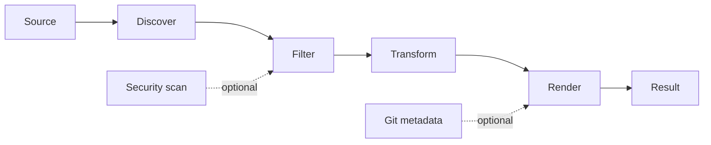

# How codemap Works

> [!NOTE]
> This page describes implementation boundaries. For installation and usage, see the [user guide](../README.md).

## Pipeline

codemap follows a small pipeline so each stage can evolve independently:

Users can run `codemap --help` at any time to display all commands and options directly in the terminal.



1. **Discover**: `CodePacker` finds files beneath the configured root in deterministic path order.
2. **Filter**: include patterns, default exclusions, custom ignore patterns, `.gitignore`, and `.ignore` determine which paths remain.
3. **Transform**: optional line numbers, comment removal, and empty-line removal modify content.
4. **Render**: renderers produce XML, Markdown, plain text, or JSON.
5. **Report**: the result includes file count, character count, token counts, Git metadata, and security exclusions.

## Configuration Precedence

```text
Built-in defaults < codemap.json / codemap.config.json < explicit CLI options
```

Command-line values override file configuration. Include and ignore lists supplied on the command line replace their configured lists.

Configuration is loaded from `codemap.json` or `codemap.config.json` when present. Explicit CLI options override file configuration. Ignore patterns are read from `.gitignore` and `.ignore`, in addition to options and built-in generated-directory exclusions. Patterns are evaluated in order and support `!` negation.

## Optional Stages

- Bounded file-size filtering, output splitting, and token budgets keep processing predictable.
- DevSkim scans original source content before transformations and excludes files with actionable findings.
- Git diff/log metadata can be added to local or remote repository context.
- Binary and invalid UTF-8 files are skipped.
- Remote input clones a repository into a temporary directory; watch mode reports changes so callers can rerun packing.

The CLI maps command-line arguments to `PackOptions`; it does not own discovery or rendering. Future capabilities should follow the same boundary. Remote repository acquisition, Git metadata, DevSkim security analysis, external processors, split output, and watch mode can be added as independent services or pipeline stages with focused tests.

Token counts use the `cl100k_base` encoding through `Microsoft.ML.Tokenizers`; counts are included per file and in output summaries.
