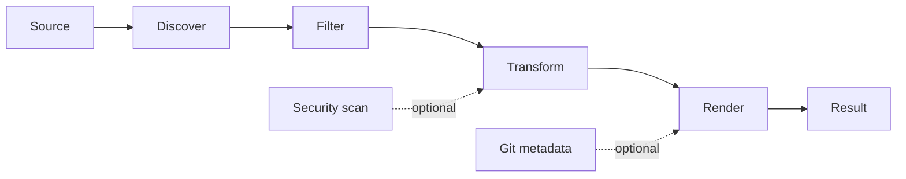

# How codemap Works

> [!NOTE]
> This page describes implementation boundaries. For installation and usage, see the [user guide](../README.md).

## Pipeline

codemap follows a small pipeline so each stage can evolve independently:

Users can run `codemap --help` or `codemap -h` at any time to display all commands and options directly in the terminal. `codemap --stdout` prints packed content without creating a file, while `codemap --clipboard` copies it through TextCopy. The `stdout` and `clipboard` subcommands remain supported. Primary source, selection, and output options also have short aliases documented in the [user guide](../README.md#command-reference).



1. **Discover**: `CodePacker` finds files beneath the configured root in deterministic path order.
2. **Filter**: include patterns, default exclusions, custom exclude patterns, `.gitignore`, and `.ignore` determine which paths remain. Include and exclude values can be literal files, literal or wildcard folders, or comma-separated glob patterns using `*`, `**`, and `?`; whitespace around comma-separated values is ignored.
3. **Security**: DevSkim redacts every non-suppressed finding in place as `***`; security findings do not remove files from output.
4. **Transform**: optional line numbers, comment removal, and empty-line removal modify content.
5. **Render**: renderers produce XML, Markdown, plain text, or JSON.
6. **Report**: the result includes file count, character count, token counts, Git metadata, and security exclusions.

Skills are an optional context stage. `--skills` / `-s` resolves names from project Skill directories before user-global directories or reads explicit `SKILL.md` paths. Skill content is treated as data, never executed, and is added to the selected output format after packing.

## Configuration Precedence

```text
Built-in defaults < codemap.json < explicit CLI options
```

Command-line values override file configuration. Include and exclude lists supplied on the command line replace their configured lists.

Configuration is loaded from one global file under the current user's profile: `%USERPROFILE%/.codemap/codemap.json` on Windows and `~/.codemap/codemap.json` on Linux or macOS. The `codemap config` command creates the `.codemap` directory and default file when needed, then merges only explicitly supplied options. Repository configuration files, `--config`, and `--config-template` are not supported. `outputMode` selects the default destination: `file`, `stdout`, or `clipboard`; it defaults to `clipboard`. Explicit destination commands and flags override it for one run. Boolean values supplied to `config` use explicit `true` or `false` values, including JSON-style names such as `--includeGitDiffs false`. Explicit packing CLI options override file configuration. `copyToClipboard` can copy normal file or stdout output without changing its destination; `--no-copy-to-clipboard` disables it for one run. Exclude patterns are read from `.gitignore` and `.ignore`, in addition to options and built-in generated-directory exclusions. Each file uses one pattern per line; blank lines and `#` comments are skipped. Patterns are evaluated in order and support `!` negation. `.gitignore` is loaded first, `.ignore` second, and `--exclude` patterns after both files. Include patterns are applied last.

## Optional Stages

- Bounded file-size filtering, output splitting, and token budgets keep processing predictable.
- DevSkim scans original source content before transformations and redacts security findings in place.
- Git diff/log metadata can be added to local or remote repository context.
- Binary and invalid UTF-8 files are skipped.
- Remote input clones a repository into a temporary directory; watch mode reports changes so callers can rerun packing.
- Selected Skills are read as text and included in the output without executing their instructions.

The CLI maps command-line arguments to `PackOptions`; it does not own discovery or rendering. Future capabilities should follow the same boundary. Remote repository acquisition, Git metadata, DevSkim security analysis, external processors, split output, and watch mode can be added as independent services or pipeline stages with focused tests.

Token counts use the `cl100k_base` encoding through `Microsoft.ML.Tokenizers`; counts are included per file and in output summaries.
